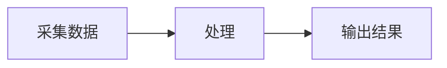

# Zhuze 个人网站

这是 Zhuze 的个人网站和博客项目，使用 [Astro](https://astro.build/)、[astro-pure](https://astro-pure.js.org/) 和 Bun 构建，使用 Vercel 自动部署。

网站地址：<https://zhuze.website>

## 一、项目结构

~~~text
src/
├─ content/blog/       博客文章，支持 Markdown 和 MDX
├─ content/docs/       文档内容
├─ pages/              页面和路由
├─ assets/             网站图片、头像和样式资源
└─ site.config.ts      网站名称、菜单、页脚和功能配置
public/                网站公开静态资源，例如图标和社交分享图片
astro.config.ts        Astro、域名和部署相关配置
package.json           项目命令和依赖
~~~

## 二、本地环境

### 运行环境要求

- Windows、macOS 或 Linux
- Node.js 22.12 或更高版本
- Bun
- Git

本项目当前使用 Astro 6，建议使用偶数版本的 Node.js，优先使用 Bun 执行命令。

检查环境是否安装成功：

~~~powershell
node --version
bun --version
git --version
~~~

### 安装依赖

在项目根目录执行：

~~~powershell
bun install
~~~

如果依赖已经安装过，通常不需要重复执行。

### 启动本地开发环境

~~~powershell
bun run dev
~~~

然后在浏览器打开：

<http://localhost:4321>

本地开发服务器运行期间，修改代码后页面通常会自动刷新。

### 检查和构建

提交代码前建议执行：

~~~powershell
bun run check
~~~

构建生产版本：

~~~powershell
bun run build
~~~

本项目使用 Vercel 适配器，生产部署由 Vercel 完成，不需要手动上传构建目录。若需要预览构建结果，可以执行：

~~~powershell
bun run preview
~~~

## 三、网站配置

大部分个性化设置都在 `src/site.config.ts` 中完成。

### 基本信息

修改以下字段：

~~~ts
title: 'Zhuze',
author: 'Zhuze',
description: "Zhuze's personal website and blog",
~~~

这些内容会用于网站标题、作者名称、版权信息和搜索引擎描述。

### 网站语言

当前网站默认使用英文：

~~~ts
locale: {
  lang: 'en-US',
  attrs: 'en_US',
  dateLocale: 'en-US'
}
~~~

网站界面主要使用英文；博客文章可以根据需要使用中文或英文。

### 导航菜单

修改 `header.menu`：

~~~ts
menu: [
  { title: 'Blog', link: '/blog' },
  { title: 'Docs', link: '/docs' },
  { title: 'Projects', link: '/projects' },
  { title: 'Links', link: '/links' },
  { title: 'About', link: '/about' }
]
~~~

`title` 是页面上显示的文字，`link` 是页面地址。暂时不需要的菜单可以删除。

### 头像、图标和社交链接

- 网站头像：`src/assets/avatar.png`
- 网站图标：`public/favicon/`
- 分享卡片：`public/images/social-card.png`
- GitHub 等社交链接：`footer.social`
- 页脚链接：`footer.links`

更换图片时，尽量保持原来的文件路径；如果修改路径，也要同步修改配置文件中的路径。

### 评论功能

当前 Waline 评论功能关闭：

~~~ts
waline: {
  enable: false
}
~~~

如果以后启用评论，需要准备自己的 Waline 服务地址，并修改 `server` 配置。不要直接使用不属于自己的生产服务。

## 四、发布博客文章

### 推荐目录结构

每篇文章使用一个独立目录；目录名即文章的 URL 标识，建议使用全小写英文和连字符。例如下面的文章访问地址为 `/blog/canopen`：

~~~text
src/content/blog/
└─ canopen/
   ├─ index.md            正文；需要并排图片时改为 index.mdx
   └─ assets/             仅属于这篇文章的图片、SVG 等素材
      ├─ cover.png
      └─ figure-1.png
~~~

图片应始终放在文章自身的 `assets/` 目录，不要放到全站 `src/assets/`。这样删除、迁移或新增文章时，正文与素材会保持在一起。

### 新建文章

在 `src/content/blog/<slug>/index.md` 或 `index.mdx` 顶部填写 Frontmatter：

~~~md
---
title: '文章标题'
description: '用于列表与搜索展示的简短摘要。'
publishDate: 2026-09-04
tags:
  - STM32
  - Embedded
language: 'Chinese'
heroImage:
  src: './assets/cover.png'
  alt: '封面图片说明'
draft: false
---

# 文章标题

这里开始写正文。
~~~

字段说明：

- `title`：文章标题，最长 60 个字符。
- `description`：文章摘要，最长 160 个字符；会显示在首页 Posts 卡片和博客列表中。
- `publishDate`：发布日期，格式为 `YYYY-MM-DD`；首页 Posts 按日期倒序显示最新两篇。
- `tags`：文章标签；大小写会自动统一。
- `language`：可填写 `English` 或 `Chinese`。
- `heroImage`：可选封面；`src` 使用相对于正文的路径，`alt` 说明图片内容。建议使用 PNG、JPG 或 WebP。
- `draft: true`：草稿，不会出现在首页、博客列表或正式构建中；完成后改回 `false`。

### 正常插入一张图片

对于单张图片，使用普通 Markdown 语法即可，Astro 会将其处理为可部署的站内资源：

~~~md

~~~

不要使用原生 HTML 的相对路径写法，例如 ``。它不会经过 Astro 的资源处理，部署后可能出现图片不显示的问题。

### 两张图片并排显示

并排图片需要将正文命名为 `index.mdx`，并使用项目提供的 `ImageRow` 组件。它会正确导入本地资源；在手机等窄屏上自动改为上下排列。

~~~mdx
import ImageRow from '@/components/content/ImageRow.astro'
import leftImage from './assets/left.png'
import rightImage from './assets/right.png'

<ImageRow
  images={[
    { src: leftImage, alt: '左图说明', grow: 65 },
    { src: rightImage, alt: '右图说明', grow: 33 }
  ]}
/>
~~~

`grow` 表示图片在同一行中的相对宽度；上例约为 65% 和 33%。两图等宽时都填写 `grow: 1` 即可。不要再使用 `&nbsp;` 和两个原生 `` 标签强行并排。

### Mermaid 流程图

博客正文支持 Mermaid。使用 `mermaid` 代码块即可；网站只会在文章实际包含 Mermaid 图时加载渲染器。

~~~md

~~~

Mermaid 图会随网站深浅色主题渲染，并在窄屏中允许横向滚动。若语法错误，页面会保留原始代码，方便根据浏览器控制台的报错修正。

### 发布前检查

~~~powershell
bun run check
bun run build
~~~

检查通过后，将文章、素材和其他修改一起提交并推送，Vercel 会自动发布。

## 五、域名和 Vercel 配置

当前正式域名是：

~~~text
https://zhuze.website
~~~

域名配置在 `astro.config.ts`：

~~~ts
site: 'https://zhuze.website'
~~~

不要随意删除或修改以下配置，它们用于 Vercel 部署：

~~~ts
adapter: vercel({ imageService: true }),
output: 'server'
~~~

Vercel 项目当前使用以下命令：

~~~text
安装命令：bun install
构建命令：bun run build
~~~

域名 DNS 记录由域名服务商管理，Vercel 负责构建、部署、HTTPS 和全球访问。域名解析和 Vercel 中的域名状态显示为有效后，网站即可通过正式域名访问。

## 六、更新网站的方法

### 推荐方法：推送到 GitHub 自动发布

1. 修改 `src/site.config.ts` 或 `src/content/blog/` 中的文件。
2. 在本地检查项目：

   ~~~powershell
   bun run check
   bun run build
   ~~~

3. 提交并推送：

   ~~~powershell
   git add .
   git commit -m "更新网站内容"
   git push
   ~~~

4. Vercel 检测到 GitHub 的 `main` 分支更新后，会自动构建并发布新版本。
5. 等待部署完成后，刷新 <https://zhuze.website> 查看更新结果。

### 查看部署状态

进入 Vercel 项目后，打开部署列表：

- `Ready`：部署成功
- `Building`：正在构建
- `Error`：构建失败，需要查看构建日志

如果网站没有更新，先确认代码是否已经成功推送到 GitHub，并检查 Vercel 是否完成了最新一次部署。
