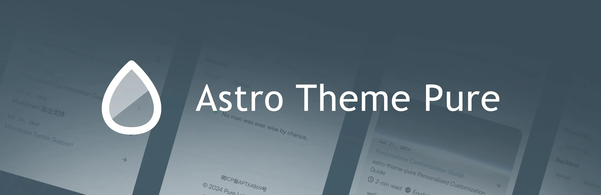
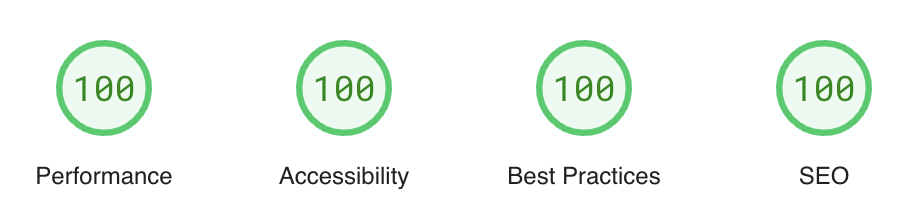

# Astro Theme Pure

English | [简体中文](./README-zh-CN.md)

A simple, fast and powerful blog & document theme built by Astro.

[](https://astro-pure.js.org/)
[](https://www.npmjs.com/package/astro-pure)
[](https://github.com/cworld1/astro-theme-pure/releases)
[](https://github.com/cworld1/astro-theme-pure/blob/main/LICENSE)




> [!NOTE]
> Known issues: Header & customize options is still under development (template exposed still).

## Introduction

Checkout [Demo Site →](https://astro-pure.js.org/)

### :fire: Features

- [x] :rocket: Fast & high performance
- [x] :star: Simple & clean design
- [x] :iphone: Responsive design
- [x] :mag: Full-site search built with [pagefind](https://pagefind.app/)
- [x] :world_map: Sitemap & RSS feed
- [x] :spider_web: SEO-friendly
- [x] :book: TOC (table of contents)
- [x] :framed_picture: Dynamic open graph generation for posts
- [x] :framed_picture: Mediumzoom lightbox for images

### :package: Components

Theme includes a lot of components, which can not only be used in the theme, but also in other astro projects.

> For other astro projects, UnoCSS is required. See [Package README](https://github.com/cworld1/astro-theme-pure/blob/main/packages/pure/README.md#use-with-common-astro-project) for more details.

- Basic components: `Aside`, `Tabs`, `Timeline`, `Steps`, `Spoiler`...
- Advanced components: `GithubCard`, `LinkPreview`, `Quote`, `QRCode`...

### :white_check_mark: Lighthouse score

[](https://pagespeed.web.dev/analysis/https-cworld-top/o229zrt5o4?form_factor=mobile&hl=en)

## Documentation

[Docs](https://astro-pure.js.org/docs) | [Showcase](https://github.com/cworld1/astro-theme-pure/issues/10)

## Package

See [astro-theme-pure](https://www.npmjs.com/package/astro-pure) on npm.

## Local development

### Environment requirements

> [!WARNING]
> Astro 6.0+ requires Node.js 22.12.0 or newer. Odd-numbered Node.js versions such as 23 are not supported by Astro.

You can choose one of the following methods for project development:

- [Bun](https://bun.com/get)
- [Node.js](https://nodejs.org/)


For deployment methods using container like [Docker](https://docs.docker.com/get-started/get-docker) & [Docker Compose](https://docs.docker.com/compose/install), please refer the documention [Using Docker Compose](https://astro-pure.js.org/docs/setup/using-docker-compose).

### Getting started

1. Clone the repository and enter the directory:
   ```shell
   git clone https://github.com/cworld1/astro-theme-pure.git
   cd astro-theme-pure
   ```

   Edit `src/site.config.ts` to customize the site.

2. Install dependencies:
   ```shell
   bun install
   ```
   
3. Start the development server:
   ```shell
   bun dev
   # or
   pnpm dev
   # or
   yarn run dev
   # or
   npm run dev
   ```
   
   The development server runs at http://localhost:4321 by default.

### Creating a new blog article

After setting up either development environment, you can create a new blog article:

```shell
bun pure new
```

## Deployment

### Manual deployment

Build the production site into the `./dist` directory:

```shell
bun run build
```
   
Once the build is complete, the generated static files will be located in the `./dist` directory. You can deploy this directory to any platform that supports static site hosting.
   
Preview the production build locally:

```shell
bun preview
```

### Static hosting platforms

You can deploy your blog to any static site hosting platform.

- Refer to the official [Astro Deployment Guide](https://docs.astro.build/en/guides/deploy/) for specific deployment methods.
- Depending on the deployment platform you choose, you may need to modify the `astro.config.ts` configuration file in the project.

| Vercel | Netlify |
| :---: | :---: |
| [](https://vercel.com/new/clone?repository-url=https%3A%2F%2Fgithub.com%2Fcworld1%2Fastro-theme-pure) | [](https://app.netlify.com/start/deploy?repository=https://github.com/cworld1/astro-theme-pure) |

## Contributions

To spend more time coding and less time fiddling with whitespace, this project uses code conventions and styles to encourage consistency. Code with a consistent style is easier (and less error-prone!) to review, maintain, and understand.

## Thanks

- [Astro Cactus](https://github.com/chrismwilliams/astro-theme-cactus)
- [Astro Resume](https://github.com/srleom/astro-theme-resume)
- [Starlight](https://github.com/withastro/starlight)

Other third party references are on [Docs#Contributions](https://astro-pure.js.org/docs/advanced/about). Appreciate for all open source libraries.

## License

This project is licensed under the Apache 2.0 License.

[](https://star-history.dera.page/#cworld1/astro-theme-pure&Date)
