import ImageRow from '@/components/content/ImageRow.astro'
import canopenLayers from './assets/QQ_1771590351415.png'
import canopenModels from './assets/QQ_1771590288290.png'
import nmtStateDiagram from './assets/image-20260220224609080.png'
import nmtStateTable from './assets/image-20260220224620559.png'
import sdoDownloadRequest from './assets/QQ_1771601239526.png'
import sdoDownloadResponse from './assets/QQ_1771601256561.png'

# CANopen 学习笔记

## 参考教程

1. [CANopen Explained - A Simple Intro (2020)](https://www.youtube.com/watch?v=DlbkWryzJqg&t=2s)
2. [CANOpen Node STM32 From basics to coding](https://www.youtube.com/watch?v=R-r5qIOTjOo)
3. [CANopen是什么？ CANopen通讯基础（下）_哔哩哔哩_bilibili](https://www.bilibili.com/video/BV1YS4y1K7CX?spm_id_from=333.788.videopod.sections&vd_source=7f3de13a6903ffa5ccc93df1b2bedccd)

## CanOpen简介

CAN负责了第 1 层物理层，第 2 层数据链路层。而CANOpen提供了设备描述、通讯描述、应用层等层面。

<ImageRow
  images={[
    { src: canopenLayers, alt: 'CANopen 分层示意图', grow: 65 },
    { src: canopenModels, alt: 'CANopen 通信模型示意图', grow: 33 }
  ]}
/>

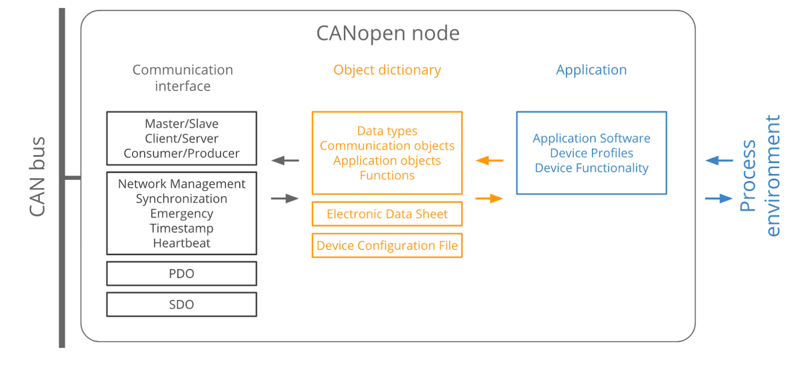

CANopen提供了三种模型：

1. **Master/Slave**：一个节点（如控制接口）作为应用主控或主机控制器，负责向从属节点（如伺服电机）发送/请求数据，该功能用于诊断或状态管理等场景。标准应用中可配置0-127个从设备。需注意，在单个CANopen网络中，多个主机控制器可共享同一数据链路层。服务示例： NMT
2. **Client/Server**：客户端向服务器发送数据请求，服务器则返回所请求的数据。例如，当主应用需要从从属应用的OD获取数据时即使用此机制。从服务器读取数据称为“上传”，而写入操作则称为下载”（该术语采用“服务器端”视角）。服务示例： SDO
3. **Consumer/Producer** ：在此场景中，生产者节点向网络广播数据，由消费者节点进行接收。生产者可选择按需发送数据（拉取模式）或无特定请求自动推送数据（推送模式）。服务实例心跳

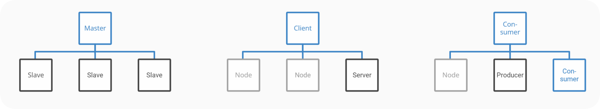

有以下重要概念：

-  **通信标识符（COB_ID）**：数据帧唯一标识
- **对象字典 OD（Object dictionary)**
- **网络管理Network Management (NMT)**：网络管理服务如停止启动节点
- **服务对象数据Service Data Object [SDO]**：设置设备参数
- **过程数据对象Process Data Object [PDO]**：快速过程数据交互如实际位置
- **紧急报文Emergency (EMCY)**：故障信息传输
- **同步报文Synchronization (SYNC)**：多个CAN节点同步
- **心跳报文Node monitoring (Heartbeat)**：消费者监控从节点状态

## 通信标识符（COB_ID）

​	COB_ID包括功能段（FUNCTION）和地址段（NODE-ID），每个CANOpen帧都以COB_ID开头，COB_ID是数据帧唯一标识符。COB_ID越小优先级越高，范围从0-0x77F，NODE-ID为系统集成商定义，范围1-127。

## **对象字典** OD（Object dictionary)

### 简介

​	对象字典就是一个有序的对象组，描述了对应 CANopen 节点的所有参数，包括通讯数据的存放位置也列入其索引，这个表变成可以传递形式就叫做 **EDS 文件**（电子数据文档Electronic Data Sheet）。

​	每个对象采用一个 16 位的索引值来寻址，这个索引值通常被称为索引，其范围在 0x0000到0xFFFF 之间。为了避免数据大量时无索引可分配，所以在某些索引下也定义了一个 8 位的索引值，这个索引值通常被称为子索引，其范围是 0x00 到 0xFF 之间。所有的参数，参数值，功能都通过**16位的index**和**8位的sub-index**组成的地址来存放读取，即CANOpen通讯的地址。网络中每一个节点都有对象字典，包含描述设备行为的所有参数。每个索引内具体的参数，最大用 32 位的变量来表示，即 Unsigned32。

### 属性定义

一个对象字典条目由以下属性定义：

-   **索引（Index）**：对象的 16 位基地址
-   **对象名称（Object name）**：制造商设备名称
-   **对象代码（Object code）**：数组（Array）、变量（Variable）或记录（Record）
-   **数据类型（Data type）**：例如 VISIBLE_STRING、UNSIGNED32 或 Record Name
-   **访问权限（Access）**：rw（读写）、ro（只读）、wo（只写）
-   **类别（Category）**：指示该参数是强制（M/O）还是可选（O/M？原文为 M/O，可能指 Mandatory/Optional）

### 对象字典概述

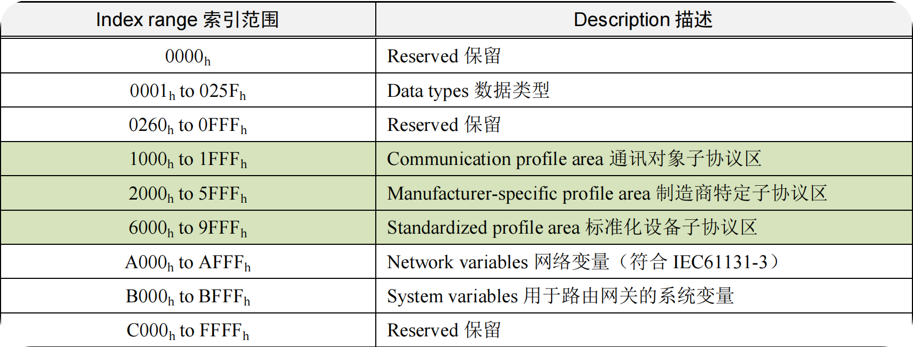

主要关注高亮部分：

- **通信对象子协议区**：设备类型，错误寄存器，支持PDO数量，参数地址
- **制造商特定子协议区**：不同厂商都不同
- **标准化设备子协议区**：相同设备都相同，不同设备就不同

## **网络管理Network Management (NMT)**

### **NMT** **节点状态**

NMT 管理涉及到一个 CANopen 节点从上电开始的 6 种状态，包括：

-   **初始化**（Initializing）：节点上电后对功能部件包括 CAN 控制器进行初始化；
-   **应用层复位**（Application Reset）：节点中的应用程序复位（开始），比如开关量输出、模拟量输出初始值；
-   **通讯复位**（Communication reset）：节点中的 CANopen 通讯复位（开始），从这个时刻起，此节点就可以进行 CANopen 通讯了。
-   **预操作状态**（Pre-operational）：节点的 CANopen 通讯处于操作就绪状态，此时此节点不能进行 PDO 通信，而可以进行 SDO 进行参数配置和 NMT 网络管理的操作；
-   **操作状态**（Operational）：节点收到 NMT 主机发来的启动命令后，CANopen 通讯被激活，PDO 通信启动后，按照对象字典里面规定的规则进行传输，同样 SDO 也可以对节点进行数据传输和参数修改；
-   **停止状态**（Stopped）：节点收到 NMT 主机发来的停止命令后，节点的 PDO 通信被停止，但 SDO 和 NMT 网络管理依然可以对节点进行操作；

除了初始化状态，NMT 主机通过 NMT 命令可以让网络中任意一个节点进行其他 5 种状态的切换。CANopen 节点也可以程序自动完成这些状态的切换。

<ImageRow
  images={[
    { src: nmtStateDiagram, alt: 'NMT 节点状态示意图', grow: 44 },
    { src: nmtStateTable, alt: 'NMT 节点状态表', grow: 53 }
  ]}
/>

### NMT模块控制报文

只有NMT-Master节点可以传输NMT Module Control报文，所有节点需支持NMT控制服务。NMT Module Control不需要应答，格式如下：

| COB-ID | Byte0 |  Byte1  |
| :----: | :---: | :-----: |
| 0x0000 |  CS   | Node-ID |

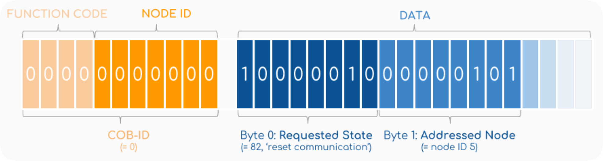

CAN ID 均为 **000h**，具备最高的 CAN 优先级。数据为 2 个字节：

◆ **第 1 个字节CS**代表命令类型：

-   **01h** 为启动命令（让节点进入操作状态）；
-   **02h** 为停止命令（让节点进入停止状态）；
-   **80h** 为进入预操作状态（让节点进入预操作状态）；
-   **81h** 为复位节点应用层（让节点的应用恢复初始状态）；
-   **82h** 为复位节点通讯（让节点的 CAN 和 CANopen 通讯重新初始化，一般用于总线受到干扰，导致节点总线错误被动或者总线关闭时）。

◆ **第二个字节**代表被控制的节点 **Node-ID**，如果要对整个网络所有节点同时进行控制，则这个数值为 0 即可。

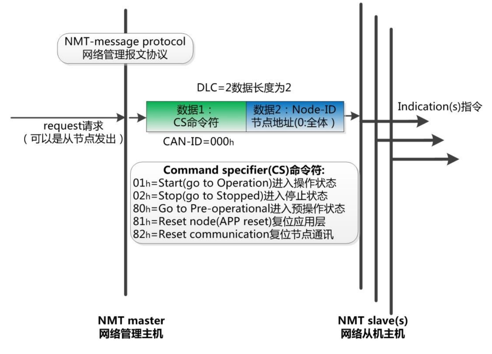

### **NMT** **节点上线报文**

任何一个 CANopen 从站上线后，为了提示主站它已经加入网络。发布Boot-UP报文通知主节点它从Initialising状态进入Pre-Operation状态

|    COB-ID     | Byte0 |
| :-----------: | :---: |
| 0x700+Node-ID |   0   |

### 心跳报文Node monitoring (Heartbeat)

节点配置为产生周期性的心跳报文，发送给消费者（主节点），从报文状态中得知从节点状态：0x04为停止状态，0x05为操作状态，0x7F为预操作状态

|    COB-ID     | Byte0 |
| :-----------: | :---: |
| 0x700+Node-ID | 状态  |

CANopen 从站按其对象字典中 1017h 中填写的心跳生产时间（ms）进行心跳报文的发送，而 CANopen 主站（NMT 主站）则会按其 1016h 中填写的心跳消费时间进行检查，假设超过诺干次心跳消费时间没有收到从站的心跳报文，则认为从站已经离线或者损坏。

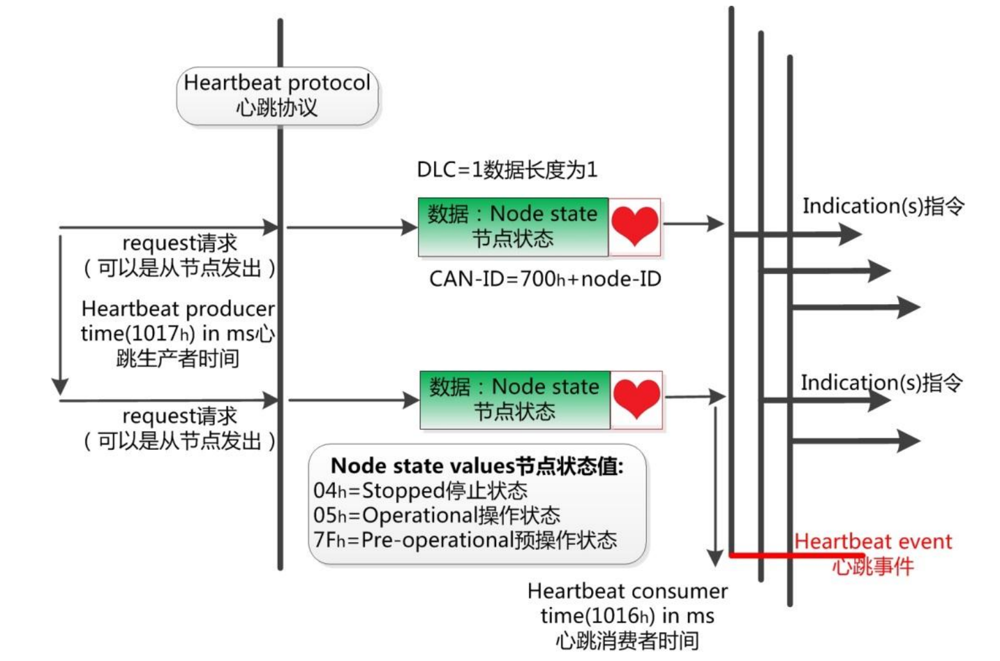

## 服务对象数据Service Data Object [SDO]

### SDO 通讯简介

- SDO 主要用于设备间传输低优先级对象，比如 CANopen **主站对从节点的参数配置**，例如PID参数，PDO配置参数。
- 服务确认是 SDO 的最大的特点，为每个消息都生成一个**应答**，确保数据传输的准确性。其请求和应答报文总是8个字节
- 通过使用索引和子索引，SDO使客户机可以**访问和编辑设备对象字典中的对象**
- 传输数据一般不超过4个字节，也可以传输任何长度的数据，超出时拆分为几个报文

| 对象（相对于从站） |                 COB-ID                 | COB-ID范围  |
| :----------------: | :------------------------------------: | :---------: |
|       Tx-SDO       | 0x600+Node-ID（主站写/读请求 -> 从站） | 0x601-0x67F |
|       Rx-SDO       | 0x580+Node-ID（从站应答/数据 -> 主站） | 0x581-0x5FF |

### SDO写报文

#### 发送报文

|    COB-ID     | DLC  | Byte0 | Byte1-2  |   Byte3    | Byte4-7 |
| :-----------: | :--: | :---: | :------: | :--------: | :-----: |
| 0x600+Node-ID |  8   |  CS   | 对象索引 | 对象子索引 |  数据   |

CS：

- 数据为1字节，CS为0x2F；
- 数据为2字节，CS为0x2B；
- 数据为3字节，CS为0x27；
- 数据为4字节，CS为0x23。

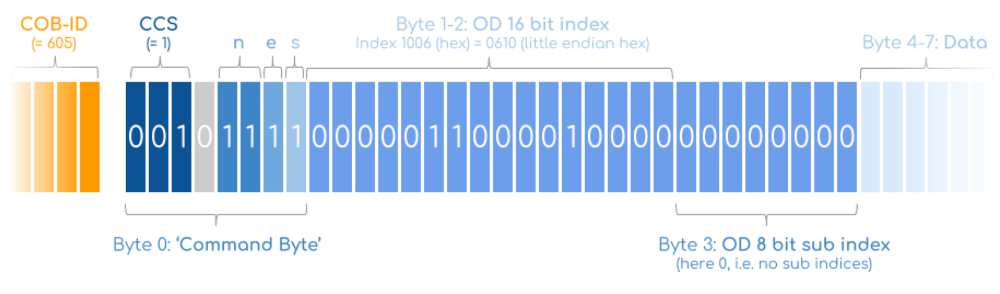

CS求解方法：

-  CCS (client command specifier)表示传输类型，1表示Download，2表示Upload
-  n 表示bytes 4-7 空字节的数量
-  e 表示“快速传输”（所有数据均位于单个CAN帧中）
-  s 表示数据大小以 n 为单位显示

#### 回应报文

|    COB-ID     | DLC  | Byte0 | Byte1-2  |   Byte3    | Byte4-7 |
| :-----------: | :--: | :---: | :------: | :--------: | :-----: |
| 0x580+Node-ID |  8   |  CS   | 对象索引 | 对象子索引 |   **    |

CS：

- 成功，CS为0x60；
- 失败，CS为0x80。

### SDO读报文

#### 发送报文

|    COB-ID     | DLC  | Byte0 | Byte1-2  |   Byte3    | Byte4-7 |
| :-----------: | :--: | :---: | :------: | :--------: | :-----: |
| 0x600+Node-ID |  8   | 0x40  | 对象索引 | 对象子索引 |   00    |

#### 回应报文

|    COB-ID     | DLC  | Byte0 | Byte1-2  |   Byte3    | Byte4-7 |
| :-----------: | :--: | :---: | :------: | :--------: | :-----: |
| 0x580+Node-ID |  8   |  CS   | 对象索引 | 对象子索引 |   **    |

CS：

- 数据为1字节，CS为0x4F；
- 数据为2字节，CS为0x4B；
- 数据为3字节，CS为0x47；
- 数据为4字节，CS为0x43；
- 失败，CS为0x80。

### SDO通信失败

|    COB-ID     | DLC  | Byte0 | Byte1-2  |   Byte3    |       Byte4-7        |
| :-----------: | :--: | :---: | :------: | :--------: | :------------------: |
| 0x580+Node-ID |  8   | 0x80  | 对象索引 | 对象子索引 | SDO abort code error |

### 快速 SDO 示意图

<ImageRow
  images={[
    { src: sdoDownloadRequest, alt: 'SDO 请求报文示意图', grow: 49 },
    { src: sdoDownloadResponse, alt: 'SDO 响应报文示意图', grow: 50 }
  ]}
/>

## 过程数据对象Process Data Object [PDO]

- **单向传输**，无需接收节点回应CAN报文来确认
- 用于传输实时数据，从一个生产者传输到多个消费者，一个PDO1次最多传输8个字节；
- 每个PDO在对象字典有2个对象描述：
	- PDO通信参数：COB-ID、传输类型、禁止时间、定时器周期；
	- PDO映射参数：对象字典中对象列表，包含数据长度，生产者消费者根据映射解释PDO内容

- 报文内容预定义，在网络启动时由主站配置

### **PDO** 通信参数

​	RPDO 通讯参数位于对象字典索引的 0x1400 - 0x15FF，TPDO 通讯参数位于对象字典索引的 0x1800 - 0x19FF。每条索引代表一个 PDO 的通信参数集，其中的子索引分别指向具体的各种参数。

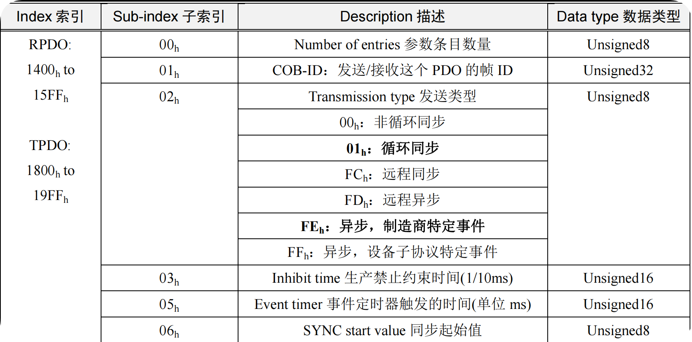

-   **Number of entries** 参数条目数量：即本索引中有几条参数；

-   **COB-ID**：即这个 PDO 发出或者接收的对应 CAN 帧 ID；

	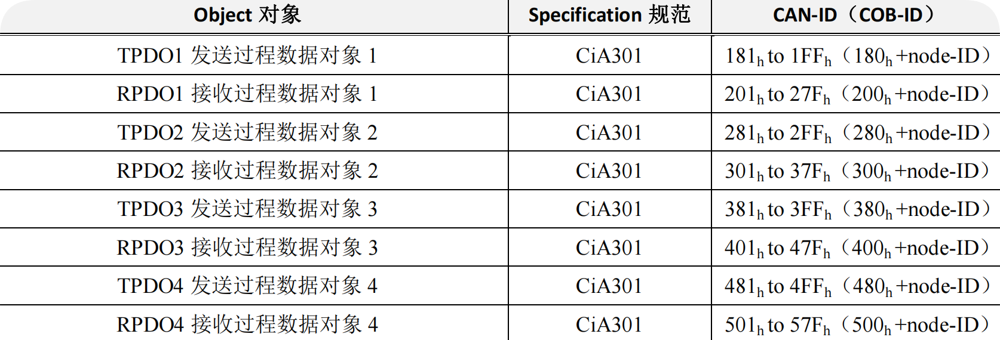

-   **发送类型**：即这个 PDO 发送或者接收的传输形式

	- **异步传输（由特定事件触发）**

		>  其触发方式可有两种，第一种是由设备子协议中规定的对象特定事件来触发（例如，定时传输，数据变化传输等）。第二种是通过发送与 PDO 的 COB-ID 相同的远程帧来触发 PDO的发送。**目前应用中的异步传输基本都采用第一种**。
	
	- **同步传输（通过接收同步对象实现同步）**

		> 同步传输就是通过同步报文让所有节点能在同一时刻进行上传数据或者执行下达的应用指令，可以有效避免异步传输导致的应用逻辑混乱的问题。一般发送同步报文的节点是 NMT 主机。

		- 周期传输（循环）: 通过接收入门教程同步对象（SYNC）来实现，可以设置 1~240 个同步对象触发;
		- 非周期传输（无循环）: 由远程帧预触发（不常用）或由设备子协议中规定的对象特定事件预触发。

	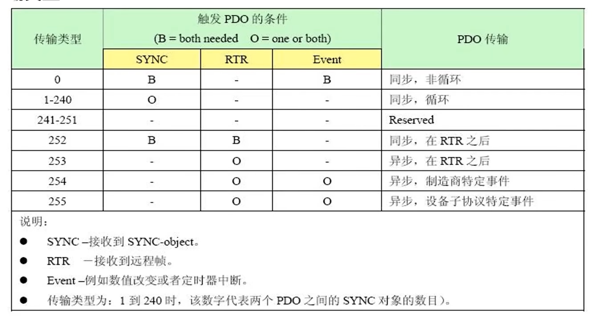

-   **Inhibit time** 生产禁止约束时间（单位 1/10ms）：约束 PDO 发送的最小间隔，避免导致总线负载剧烈增加。比如数字量输入过快，导致状态改变发送的 TPDO 频繁发送，总线负载加大，所以需要一个约束时间来进“滤波”，这个时间单位为 0.1ms；

-   **Event timer** 事件定时器触发的时间（单位 ms）：定时发送的 PDO，它的定时时间。如果这个时间为 0，则这个 PDO 为事件改变发送；

-   **SYNC start value** 同步起始值：同步传输的 PDO，收到若干个同步包后，才进行发送。这个同步起始值就是同步包数量。比如设置为 2，即收到 2 个同步包后才进行发送。

### **PDO** 映射参数

​	它包含了一个对象字典中的对象列表，这些对象映射到相应的 PDO，其中包括数据的长度（单位，位），对于生产者和消费者都必须要知道这个映射参数，才能够正确的解释 PDO 内容。就是将通信参数、应用数据和具体 CAN报文中数据联系起来。

​	RPDO 通讯参数 1400h to 15FFh，映射参数 1600h to 17FFh，数据存放为 2000h 之后厂商自定义区域；TPDO 通讯参数 1800h to 19FFh，映射参数 1A00h to 1BFFh，数据存放为 2000h 之后厂商自定义区域。

### PDO报文内容

​	不同于SDO报文内容中要包含索引 + 子索引 + 数据 + 控制字，PDO报文内容中只需要数据。**通过 PDO 映射参数，将对象字典中多个条目的实时数据拼接到一个 CAN 帧的数据域中。对于主站**：收到 PDO 后，根据对方的设备手册（EDS/DCF文件）中的映射描述，就知道数据域哪个字节代表哪个物理量。**对于从站**：根据内部的映射表，在触发条件满足时，去对应的对象字典索引里“抓取”数据，打包发出。因此需要**主站和从站的PDO映射参数必须完全匹配**。

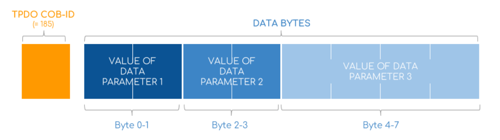
### 举例

以 STM32 作为主机，电机为从机：

- **电机从站** 用 **TPDO** 发送实际位置给 STM32
- **STM32主站** 用 **RPDO** 接收这个实际位置
- **STM32主站** 用 **TPDO** 发送目标位置给电机
- **电机从站** 用 **RPDO** 接收这个目标位置"

​	实际中电机的PDO通常是厂家预设的，**让STM32主站的配置与电机匹配**：配置主站的RPDO，接收电机的TPDO；配置主站的TPDO，发给电机的RPDO。如果需要对电机的PDO做高级配置，只需要使用SDO对应修改。

​	如果要控制多台电机，为**每个电机独立准备一套 PDO 通道**（TPDO/RPDO），若控制4台，刚好用完**4 个 TPDO 和 4 个 RPDO**，注意电机的TPDO和STM32对应的RPDO的COB-ID保持一致。

## 紧急报文Emergency (EMCY)

紧急事件对象（Emergency），是当设备内部发生错误，触发该对象，发送设备内部错误代码，提示NMT 主站。

|    COB-ID     |   Byte0-1    |          Byte2           |      Byte3-7       |
| :-----------: | :----------: | :----------------------: | :----------------: |
| 0x080+Node-ID | 应急错误代码 | 错误寄存器（对象0x1001） | 制造商特定错误区域 |

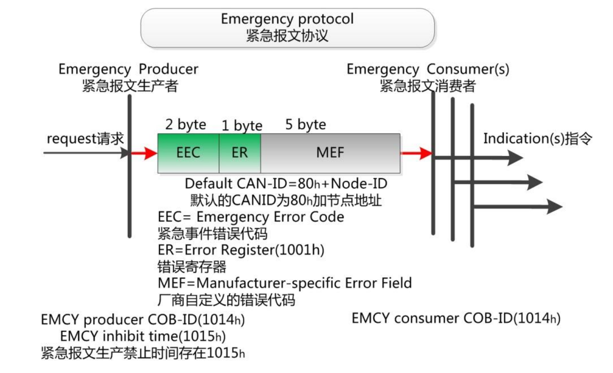

## 同步报文Synchronization (SYNC)

- 其数据帧为：COB-ID：0x80，无数据；
- 主要作用（仅用于PDO）：
	- 控制TPDO发送；
	- 控制RPDO激活；
	- 同步各节点时钟。

