# HRTIM

## 简介

HRTIM， High-Resolution Timer，高分辨率定时器，是 STM32 中专门用于产生高精度、复杂 PWM 波形的定时器外设。它是一个由 Master Timer、多个子 Timer、Compare 比较单元、Set/Reset 事件、输出控制、死区控制、ADC 触发和 Fault 故障保护共同组成。HRTIM 的核心用途是：在**高频 PWM 场景下仍保持很细的占空比调节能力**，并能精确协调多路 PWM、互补输出、相移控制、ADC 同步采样和硬件级保护。 

## 整体结构

HRTIM 内部不是单个计数器，而是由一个 Master Timer 和多个子 Timer 组成。Master Timer 通常作为同步基准，Timer A/B/C/D/E/F 等子定时器负责产生具体 PWM 波形。每个子 Timer 有自己的 Period、Compare 和输出通道，可以独立工作，也可以互相同步或相移。

```txt
Master Timer：总节拍器，负责同步
Timer A：子定时器，可以产生 TA1 / TA2 输出
Timer B：子定时器，可以产生 TB1 / TB2 输出
Timer C：子定时器，可以产生 TC1 / TC2 输出
...
Output：真正从芯片引脚输出的 PWM 波形
```

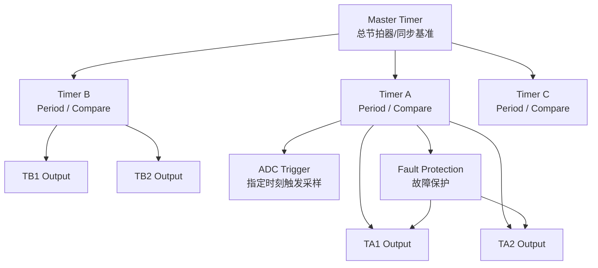


## 核心概念

### Period

Period 是周期值，用来决定 PWM 的周期和频率。HRTIM 的某个 Timer 从 0 开始计数，计数到 Period 后进入下一个周期。因此，Period 越大，PWM 周期越长，频率越低；Period 越小，PWM 周期越短，频率越高。

### Compare

Compare 是比较值，用来定义一个周期内部的关键时间点。当计数器 CNT 计数到 Compare 值时，HRTIM 会产生一个比较事件。这个事件可以用来改变输出状态。占空比 ≈ Compare / Period

### Set / Reset 事件

HRTIM 生成 PWM 的本质不是简单地判断 CNT 是否小于 CCR，而是在时间轴上安排事件。Set 事件让输出变为有效电平，Reset 事件让输出变为无效电平（看输出极性 Polarity）。通过选择不同的 Set Source 和 Reset Source，就可以决定 PWM 在什么时候变高、什么时候变低。举例：

1. 普通高电平 PWM

	```txt
	Timer A:
	Period = 10000
	Compare1 = 3000
	Output TA1:
	Set Source   = Period 事件
	Reset Source = Compare1 事件
	
	当一个 PWM 周期开始时，TA1 被 Set，输出变高；
	当计数器数到 Compare1 = 3000 时，TA1 被 Reset，输出变低；
	当计数器数到 Period = 10000 时，本周期结束，下一个周期重新开始。
	CNT:     0              3000                         10000
	         |---------------|-----------------------------|
	事件:    Period/周期开始  Compare1                      Period/下周期开始
	动作:    Set TA1         Reset TA1                     Set TA1
	TA1:     高高高高高高高高 低低低低低低低低低低低低低低低
	```

2. 反相 PWM

	```txt
	Set Source   = Compare1 事件
	Reset Source = Period 事件
	
	CNT:     0              3000                         10000
	         |---------------|-----------------------------|
	事件:    周期开始         Compare1                      Period
	动作:    Reset TA1       Set TA1                       Reset TA1
	TA1:     低低低低低低低低 高高高高高高高高高高高高高高高
	```

### Output

Timer 是内部计数模块，Output 是实际输出到芯片引脚的 PWM 通道。HRTIM 中一个 Timer 通常可以对应一对输出，例如 Timer A 对应 TA1 和 TA2。计数器运行并不等于引脚一定有波形，必须配置输出通道如何被 Set/Reset 事件控制。

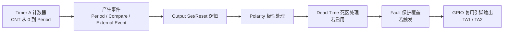

### 互补输出

指同一个 Timer 产生两路相反或近似相反的 PWM，用于控制半桥或全桥电路中的上管和下管。例如 TA1 控制上管，TA2 控制下管。当上管导通时，下管关断；当上管关断时，下管导通。但是实际中不能直接这么切换，因为 MOS 管开关有延迟。因此需要死区。

### Dead Time 死区

Dead Time，死区时间，是互补 PWM 中专门插入的一小段两路都不导通的时间，用来防止半桥或全桥上下管同时导通。它的作用是保护功率器件，避免电源直通短路。死区太小可能导致直通，死区太大会降低有效占空比并增加波形失真。

### 同步与相移

HRTIM 的多个子 Timer 可以独立运行，也可以由 Master Timer 统一同步。同步表示多个 Timer 共享同一个时间基准；相移表示它们虽然周期相同，但启动或输出事件在时间上错开一定角度。同步和相移使 HRTIM 很适合多相电源、逆变器和复杂 PWM 控制。

```txt
Ex : 四相 Buck
A 相：0°
B 相：90°
C 相：180°
D 相：270°
```

### ADC Trigger

HRTIM 可以在 PWM 周期内的指定时刻触发 ADC 采样。这个功能用于让 ADC 避开开关噪声严重的瞬间，在更合适的 PWM 相位采集电流、电压等信号。对于数字电源和电机控制来说，HRTIM 不仅负责“什么时候开关”，还负责告诉 ADC“什么时候采样”。

```txt
HRTIM 输出 PWM		// MOS 管刚开通/关断时，噪声最大
↓
在指定时间点触发 ADC	// 过一小段时间后，电流相对稳定，此时采样更可靠
↓
ADC 采样电流/电压
↓
CPU 根据采样值计算下一周期占空比
↓
HRTIM 更新 PWM
```

### Fault 故障保护

Fault 是 HRTIM 的硬件故障保护输入。当外部过流、过压、过温或驱动器故障信号触发 Fault 后（支持外部事件输入和故障输入），HRTIM 可以不经过 CPU 软件判断，直接让 PWM 输出进入安全状态。Fault 的核心意义是快速保护功率器件。

### Preload / Update

Preload 表示预装载，Update 表示更新生效。HRTIM 在运行时修改 Period、Compare 等参数时，通常不会希望新参数立刻在周期中间生效，因为这可能导致 PWM 毛刺。因此可以先把新值写入缓冲区，等到指定更新事件到来时，再统一生效


## PWM 时序示例

下面的时序图展示了不同占空比下，Master Timer、Timer B、互补输出、比较事件与死区时间之间的关系。

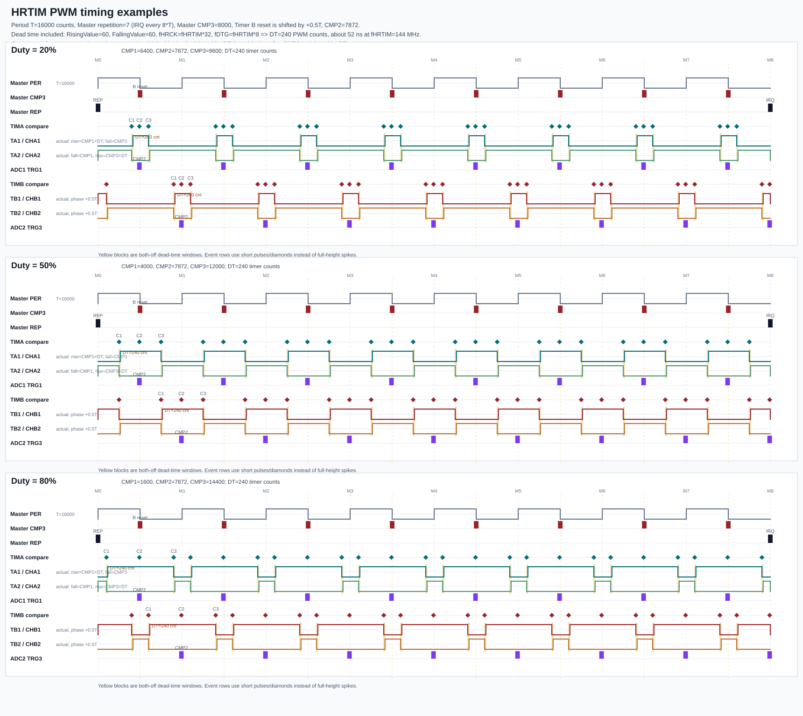

## CubeMx配置

### Master Timer

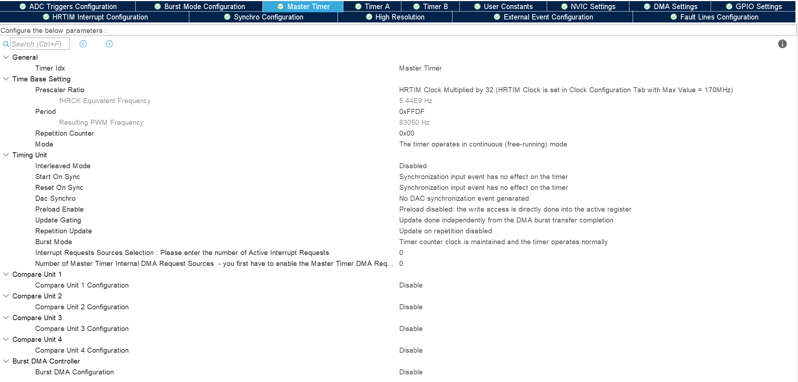

1. `Timer Idx`：表示当前正在配置的 HRTIM 定时器对象。

2. `Time Base Setting`：时基设置

	- `Prescaler Ratio`：HRTIM 预分频/时钟比例设置，决定 HRTIM 计数器使用的时间基准
	- `fHRCK Equivalent Frequency`：等效频率
	- `Period`：周期值，决定 Master Timer 多久完成一个计数周期
	- `Resulting PWM Frequency`：根据当前等效时钟、预分频和 Period 计算出的周期频率
	- `Repetition Counter`：重复计数器，用来控制某些更新事件或中断事件不是每个周期都发生，而是每隔若干个周期发生一次。（0x00每个周期都按正常方式运行）
	- `Mode`：运行模式
		- `continuous free-running mode`：连续自由运行模式，不断重复计数；

3. `Timing Unit`：运行行为控制

	- `Interleaved Mode`：交错模式，用于多相 PWM 之间的交错控制（相位）
	- `Start On Sync`：在收到同步输入事件后才启动 Timer
	- `Reset On Sync`：收到同步输入事件时把 Timer 计数器复位。
	- `DAC Synchro`：产生 DAC 同步事件，使 DAC 输出更新与 HRTIM 的时间轴同步
	- `Preload Enable`：启用预装载（影子寄存器）
	- `Update Gating`：控制更新事件是否受到某些条件限制（决定 Period、Compare 等预装载参数在什么条件下真正更新到活动寄存器）
	- `Repetition Update`：是否根据 Repetition Counter 触发更新事件。启用后，更新事件可以不是每个周期发生，而是按照重复计数器的节奏发生。
	- `Burst Mode`：是否让 Timer 进入突发/间歇工作模式。
	- `Interrupt Requests Sources Selection`：选择 Master 内部哪些事件产生中断请求。
	- `Number of Master Timer Internal DMA Request Sources`：内部 DMA 请求源数量

4. `Compare Unit 1 ~ 4`：

	Compare Unit 是比较单元，用于在 Timer 计数到某个指定值时产生 Compare 事件，可以用来触发输出 Set/Reset、触发 ADC、触发中断、触发 DMA，或者作为其他 Timer 的同步事件。

5. `Burst DMA Controller`：

	用于通过 DMA 批量更新 HRTIM 的多个寄存器，例如 Period、Compare、Dead Time 等。适合高速、周期性、批量改变 PWM 参数的场景。

### TimerA/B

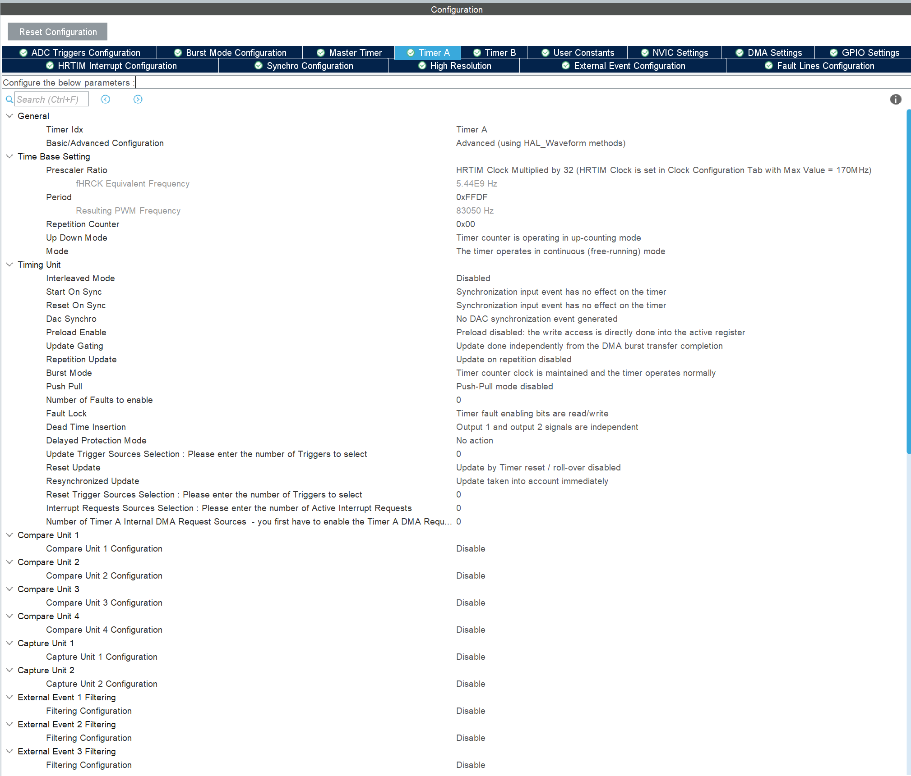

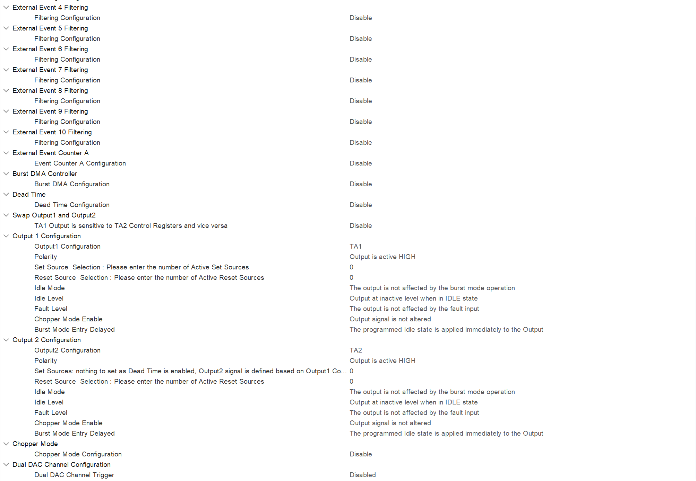

```txt 含义基本一样
Prescaler Ratio
fHRCK Equivalent Frequency
Period
Resulting PWM Frequency
Repetition Counter
Mode
Interleaved Mode
Start On Sync
Reset On Sync
DAC Synchro
Preload Enable
Update Gating
Repetition Update
Burst Mode
Interrupt Requests Sources Selection
DMA Request Sources
Compare Unit 1~4
Burst DMA Controller
```

1. **Basic / Advanced Configuration**：决定 Timer A 使用基础 PWM 配置还是高级 Waveform 配置；高级模式下可以手动配置 Set/Reset、死区、Fault 等复杂波形逻辑。
2. **Up Down Mode**：决定 Timer A/B 是普通向上计数，还是上下计数形成中心对齐 PWM。
3. **Push Pull**：用于双输出交替工作的特殊模式，启用后 Timer A 的两个输出可按周期轮流工作。
4. **Number of Faults to enable**：设置该 Timer 启用多少条 Fault 故障保护输入线。
5. **Fault Lock**：决定 Fault 相关使能位是否允许继续修改，用于防止保护配置被误改。
6. **Dead Time Insertion**：决定 Output1 和 Output2 是否插入死区，常用于互补 PWM，防止上下桥臂直通。
7. **Delayed Protection Mode**：决定故障或保护信号发生后，输出是立即关闭，还是延迟到指定安全时刻再处理。
8. **Update Trigger Sources Selection**：选择哪些事件可以触发 Timer A 的参数更新，使 Period、Compare 等新值生效。
9. **Reset Update**：决定 Timer A 在复位或计数溢出时，是否触发参数更新。
10. **Resynchronized Update**：决定更新事件是否需要重新同步后再生效，还是立即生效。
11. **Reset Trigger Sources Selection**：选择哪些事件可以复位 Timer A 的计数器，使计数器重新从起点开始计数。
12. **Compare Unit 1~4**：设置 Timer A 周期内的比较点，用于产生 Compare 事件，进而控制 PWM 的 Set/Reset、ADC 触发或中断等。
13. **Capture Unit 1~2**：用于捕获外部事件发生时 Timer A 的计数值，用于测量脉宽、频率或相位。
14. **External Event 1~10 Filtering**：对外部事件输入进行滤波，防止毛刺信号误触发 动作。
15. **External Event Counter A**：用于对外部事件进行计数，达到指定次数后再触发相应动作。
16. **Burst DMA Configuration**：用于通过 DMA 批量更新 HRTIM 的多个参数，如 Period、Compare、Dead Time 等。
17. **Dead Time Configuration**：具体设置死区时间的大小，包括上升沿死区和下降沿死区。
18. **Swap Output1 and Output2**：交换 Output1 和 Output2 的控制关系，使 TA1/TA2 的逻辑映射互换。
19. **Output1 Configuration**：配置 Timer A 的第一个输出通道 TA1，它是实际可映射到 GPIO 的 PWM 输出之一。
20. **Output2 Configuration**：配置 Timer A 的第二个输出通道 TA2，可作为独立 PWM 输出，也可作为 TA1 的互补输出。
21. **Polarity**：设置输出极性，决定 Output 有效状态对应 GPIO 高电平还是低电平。
22. **Set Source Selection**：选择哪些事件会让输出进入有效状态；active high 时通常为输出变高。
23. **Reset Source Selection**：选择哪些事件让输出进入无效状态；active high 时通常为输出变低。
24. **Idle Mode**：决定 Burst Mode 或空闲状态是否会影响该输出。
25. **Idle Level**：设置输出进入 IDLE 空闲状态时保持的电平。
26. **Fault Level**：设置 Fault 故障发生时输出进入的安全状态，如强制高/低电平电平或不受影响。
27. **Chopper Mode Enable**：决定是否对输出 PWM 叠加斩波调制，普通 PWM 一般不用。
28. **Burst Mode Entry Delayed**：决定进入 Burst/Idle 状态时，空闲电平是立即应用还是延迟应用。
29. **Chopper Mode Configuration**：配置斩波模式的具体参数，用于特殊调制输出场景。
30. **Dual DAC Channel Trigger**：设置 Timer A 是否触发双 DAC 通道同步更新，使 DAC 输出与 PWM 时间轴同步。

### Example

#### Mater Time

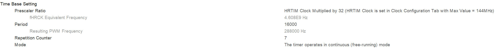
- 等效时钟为 4.608 GHz
- PWM 频率 288 kHz
- 每 8 个 Master 周期触发一次 repetition event，repetition event / repetition interrupt 频率是**36 kHz**。
- 连续运行模式，，不需要外部触发启动。启动 HRTIM 后它会一直计数、溢出、更新。

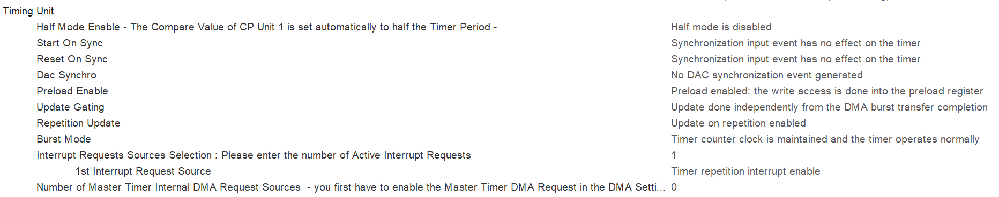

-  不是半周期模式。计数周期就是完整的 `Period = 16000`。
- 外部同步事件不会启动它，也不会复位它，不受外部同步输入影响。
- 写 Period、Compare 等寄存器时，不会立刻改当前正在运行的寄存器，而是先写入预装载寄存器，等更新事件再统一加载。
- 寄存器更新发生在 repetition event 时，而不是每个 PWM 周期都更新。（8个PWM周期）
- 只开了一个中断源 repetition interrupt，每 8 个 Master 周期会进一次中断，频率约 36 kHz。

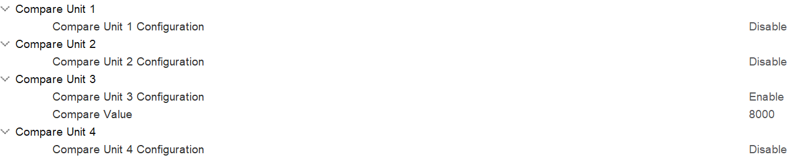

Compare 3 设置在周期中点，在 Master Timer 计数到周期一半时产生一个比较事件，用它去触发/复位 Timer B，从而让 Timer A 和 Timer B 相差 180° 相位。

#### TimerA

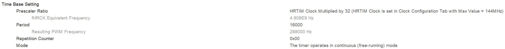

不做 repetition 分频，每个 PWM 周期都可以更新一次，控制中断主要来自 Master Timer 的 Repetition Interrupt。

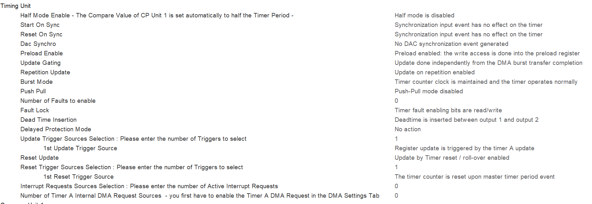

- 程序写入的预装载值会在 Timer A 被 Master 周期事件复位的周期边界统一生效
- Reset Trigger Source = Master Timer Period Event：当 Master Timer 发生 Period Event 时，Timer A 的计数器被复位。周期起点被 Master 对齐，同频同相。
- 不产生中断

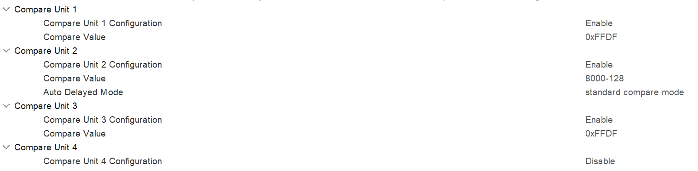

- Compare Unit 1 开启，Compare Value = 0xFFDF：A 半桥的 PWM 是用 **ACMP1 和 ACMP3 控制开关边沿**。CMP1 决定上管打开位置，CMP3 决定上管关闭位置。在当前静态配置下，Timer A 正常从 0 计到 16000，不会碰到 65503，因此 CMP1 当前不会在周期内产生有效比较事件。`0xFFDF`作为一个安全初值/占位值，运行时会由代码动态更新为合法的 CMP1 值。
- Compare Unit 2 开启，Compare Value = 8000 - 128：在 PWM 周期中间附近产生一个事件，用于触发 ADC 采样，以降低干扰。

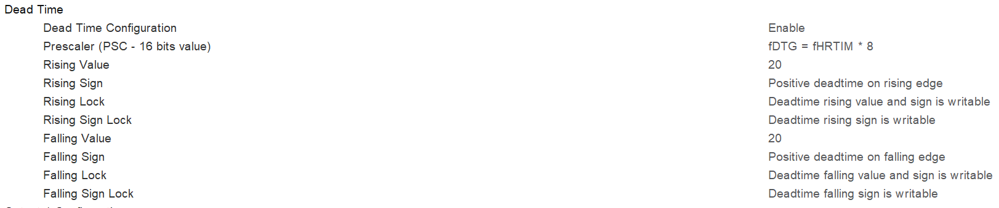

- fDTG = fHRTIM × 8：死区计数器的时钟来源，一个 deadtime tick约为0.868ns
- Rising Value = 20：与上升沿相关的死区处理上，死区计数值为 20

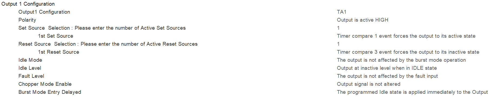

- 配置 Timer A 的第一个输出通道 TA1
- 有效电平为高电平
- 当 Timer A 计数到 CMP1 时，TA1 被强制置为 active，输出高电平。
- 当 Timer A 计数到 CMP3 时，TA1 被强制置为 inactive，也就是输出低电平。
- 进入 IDLE 状态时输出无效电平。

```txt
计数器：0 -------- CMP1 -------- CMP3 -------- Period
TA1：       低            高             低
```

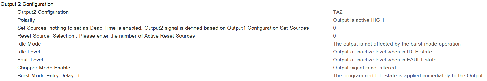

 不再单独配置 Set Source 和 Reset Source。其为TA1 的互补输出，波形由 TA1 的配置与Dead Time自动推导出来

#### TimerB


Master Timer 计数到 CMP3 (周期一半)时，Timer B 被复位，实现相位差180度。

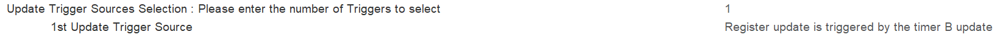

Timer A 在 Master 周期起点更新，Timer B 在 Master 周期中点附近更新。

#### ADC

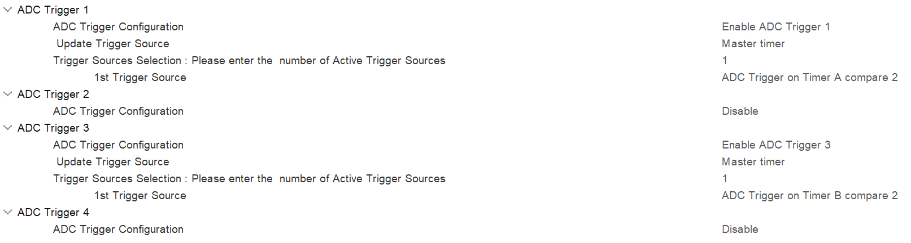

ADC Trigger 1 由 Timer A 的 CMP2 触发；ADC Trigger 3 由 Timer B 的 CMP2 触发，在 A 半桥和 B 半桥 PWM 周期的中间附近分别触发 ADC 采样。
