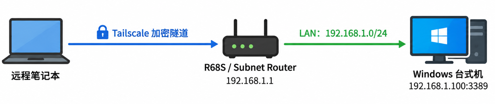
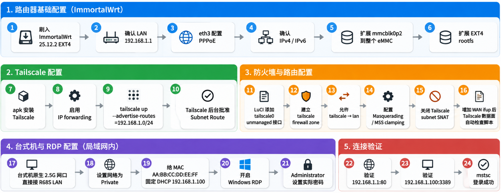
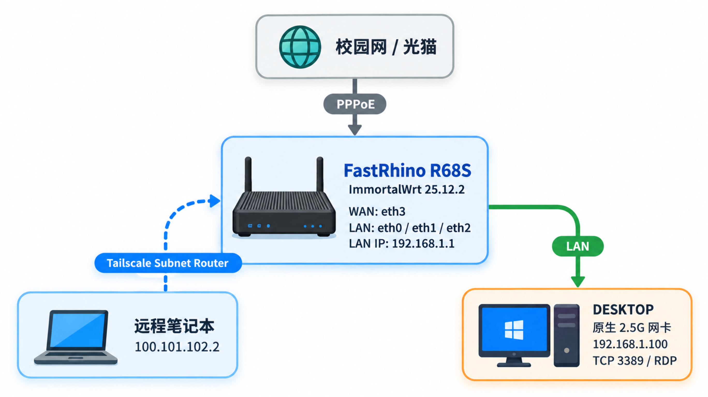
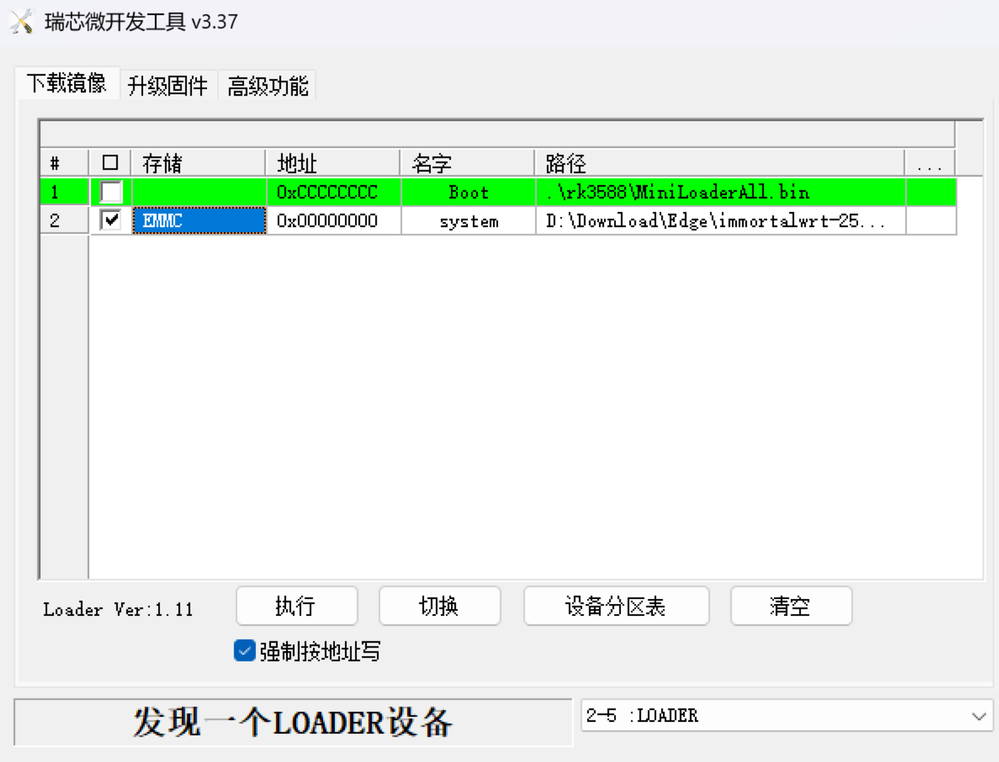
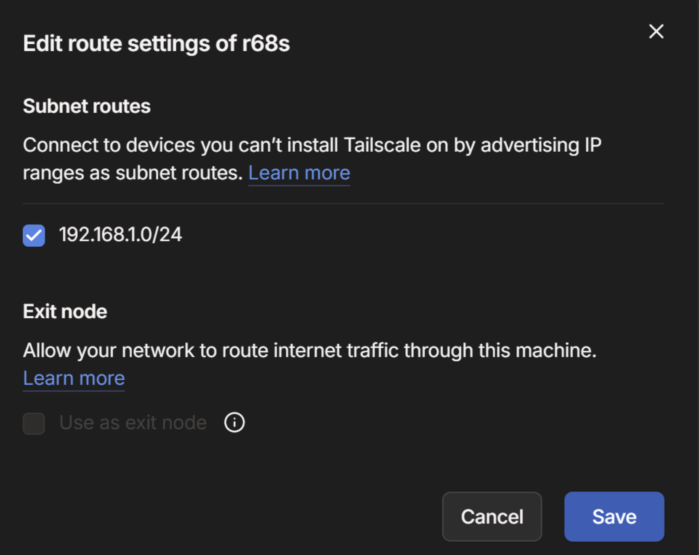
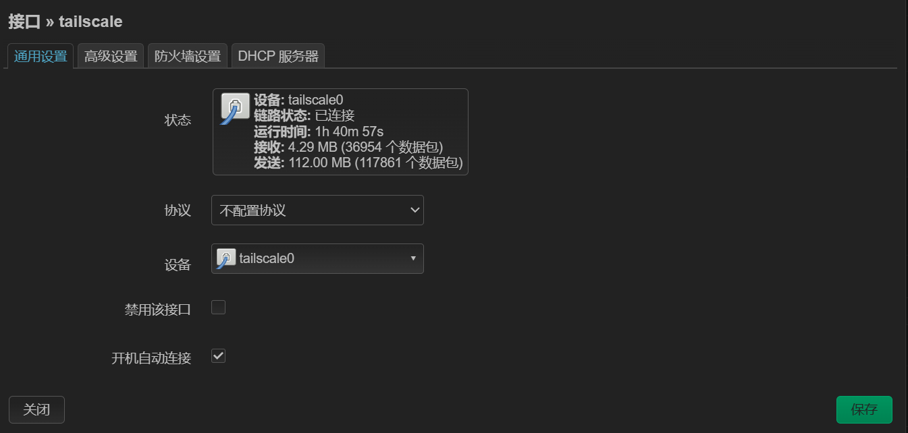
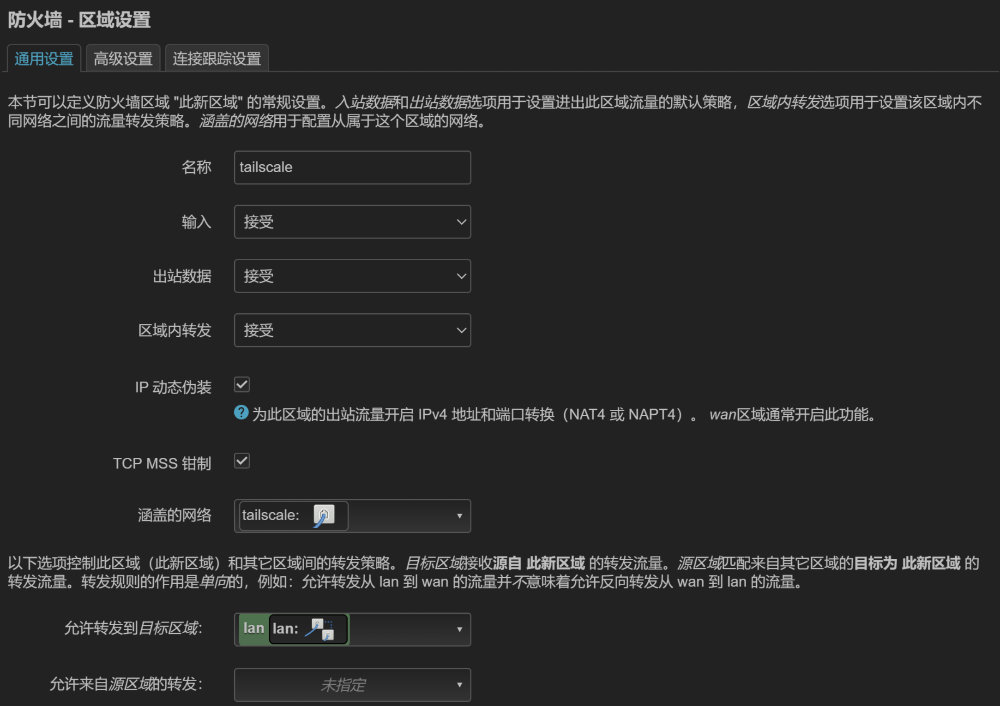
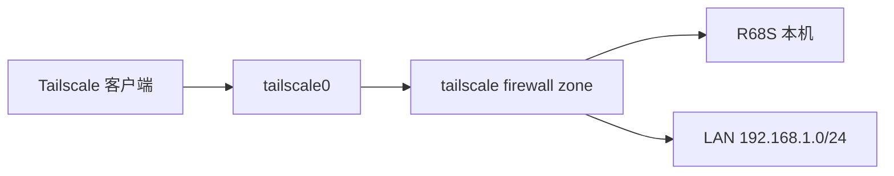
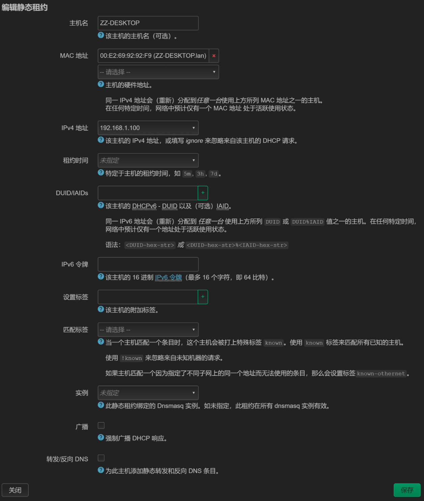
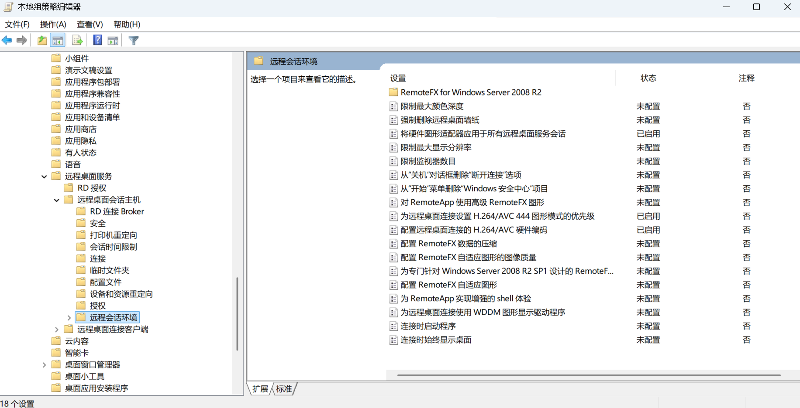

# FastRhino R68S 远程访问配置：Tailscale + RDP

> 目标：将 FastRhino R68S 配置为校园网 PPPoE 主路由，并作为 Tailscale Subnet Router，使远程笔记本能够通过校园网直接访问 R68S 后方的台式机。
>
> 注意：目前方案需要被控端为 **windows 专业版**才能使用远程连接，下一步使用 sunshine 系列方案在探索中。  

## 解决的问题

远程访问方案：使用 FastRhino R68S 作为主路由，在 ImmortalWrt 上部署 Tailscale，并让 R68S 充当 **Subnet Router（子网路由器）**。远程笔记本只要加入同一个 Tailnet，就可以直接访问 R68S 后方的 Windows 台式机，而不需要把 RDP 的 3389 端口直接暴露到公网，也不要求台式机本身安装 Tailscale。

整套链路大致如下：



最终实现效果：在外部网络中，笔记本可以直接访问 `192.168.1.1` 管理 R68S，也可以通过 `mstsc` 连接 `192.168.1.100` 进入台式机桌面；R68S 重启后，Tailscale 和远程桌面链路也可以自动恢复。后续如果要扩展到 SSH、NAS、树莓派或其他内网服务，本质上也只是继续访问 `192.168.1.x:端口`。

## 地址和设备对应关系

全文统一按如下对应关系：

| 角色 | 本文示例 | 说明 |
|:-:|:-:|:-:|
| R68S LAN 地址 | `192.168.1.1` | 内网网关，也是 LuCI 管理地址 |
| R68S 后方 LAN | `192.168.1.0/24` | 需要通过 Tailscale 发布的子网 |
| Windows 台式机 | `192.168.1.100` | 固定 DHCP 地址 |
| Windows RDP | `192.168.1.100:3389` | 最终远程桌面目标 |
| R68S Tailscale 地址 | `100.101.102.1` | 匿名示例，实际由 Tailscale 自动分配 |
| 远程笔记本 Tailscale 地址 | `100.101.102.2` | 匿名示例，实际由 Tailscale 自动分配 |
| 台式机有线网卡 MAC | `AA:BB:CC:DD:EE:FF` | 匿名示例，实际配置时换成自己的 MAC |
| Windows 主机名 | `DESKTOP` | 匿名示例，实际使用自己的主机名 |

> **注意：** `100.x` 的 Tailscale 地址和 `fd7a:` 地址由 Tailscale 自动分配，不需要照抄；`192.168.1.1`、`192.168.1.100` 和 `192.168.1.0/24` 则是为了让整篇文章的路由逻辑保持清晰而保留的示例。如果你的 LAN 使用其他网段，请整体替换，但一定保持“R68S LAN、发布子网、台式机固定地址”三者属于同一个局域网。

## 一、总体流程与拓扑

**刷入 ImmortalWrt → 配好 PPPoE 和 IPv4/IPv6 → 扩展 eMMC rootfs → 安装 Tailscale →  R68S 发布 `192.168.1.0/24` → 配置 `tailscale0` 与 firewall4 → 远程笔记本接受子网路由 → 台式机固定 `192.168.1.100` → 开启并验证 RDP → 增加 Tailscale 开机自恢复 → 按需优化 RDP 帧率和 Wake-on-LAN。** 



后文所有地址都围绕这张图展开，配置时需要把示例中的设备名、MAC 和 Tailscale 地址替换为自己的实际值。



---

## 二、准备 R68S：固件、上网与存储

### 1. 硬件与固件基线

设备：
```text
FastRhino R68S
SoC: Rockchip RK3568
eMMC: 16 GB
```

当前固件：
```text
ImmortalWrt 25.12.2
Target: rockchip / armv8
包管理器: apk
防火墙: firewall4 / nftables
```

当前网口映射：
```text
eth0  LAN
eth1  LAN
eth2  LAN
eth3  WAN
```

物理上：
```text
最靠近电源的网口 = WAN / eth3
其余三个口       = LAN
```
相关教程：[零基础——玩转电犀牛R68S – ConstantineFun](https://www.constantinefun.com/?p=753)

---

### 2. 固件恢复 / 重刷

使用的 EXT4 镜像：

https://downloads.immortalwrt.org/releases/25.12.2/targets/rockchip/armv8/immortalwrt-25.12.2-rockchip-armv8-lunzn_fastrhino-r68s-ext4-sysupgrade.img.gz

对应 SHA256：
```text
b734b3d9f757e4740b39223a41279787581c5630dac9691a768777736a3c2b87
```

驱动：https://static2.fnnas.com/installer/DriverAssitant_v5.1.1.zip

刷机工具：https://static2.fnnas.com/installer/RKDevTool_v3.37_for_window.zip

先右键以管理员的方式运行Driverinstall，点击驱动安装，弹出对话框，点击安装。右键以管理员的方式运行RKDevTool，使用双公头的数据线连接电脑和标有OTG的USB接口（靠近指示灯的接口），按住recovery孔，插入电源，2~5s松开短接点，刷机软件提示发现一个LOADER设备即可进行下一步（此时主板绿色指示灯常亮，蓝色指示灯熄灭），如果没有发现则拔出电源线和usb数据线重新执行本操作。

如下配置：

勾选强制按地址写，路径修改为本地固件地址（解压缩的），储存在 EMMC，准备好后执行。



---

### 3. 首次启动、PPPoE 与基础连通性

**重刷后的 LAN 初始状态。** 电脑连接 R68S LAN 后，应通过 DHCP 获得：
```text
IPv4: 192.168.1.x
Mask: 255.255.255.0
Gateway: 192.168.1.1
```

LuCI：
```text
http://192.168.1.1
```

如果 Windows 得到：
```text
169.254.x.x
```

表示没有成功获得 DHCP 地址。

---

**配置 PPPoE。** LuCI：

```text
网络
→ 接口
→ WAN
→ 修改
```

配置：
```text
协议: PPPoE
设备: eth3
用户名: 校园网 PPPoE 账号
密码: 校园网 PPPoE 密码
```

成功后 WAN 应显示类似：
```text
协议: PPPoE
IPv4: 10.x.x.x/32
运行时间持续增加
```

---

**验证 IPv4、DNS 和 IPv6。** 客户端：
```powershell
ping 223.5.5.5
```

期待：
```text
0% 丢包
```

测试域名：
```powershell
ping www.baidu.com
```

实测可以解析到 IPv6：
```text
240e:...
```

并正常通信，说明：
```text
IPv4   正常
DNS    正常
IPv6   正常
```

R68S / LAN 侧也实际获得过：
```text
240c:c283:...
```

的全球 IPv6 地址和前缀。

---

### 4. eMMC rootfs 扩容

官方 EXT4 镜像首次启动后：
```bash
df -h /
```

只能看到约：
```text
/dev/root  ~300M
```

但实际 eMMC 约 14.8 GiB。

检查：
```bash
cat /proc/partitions
```

初始类似：
```text
mmcblk0     15155200
mmcblk0p1      16384
mmcblk0p2     307200
```

进一步：
```bash
parted -s /dev/mmcblk0 unit MiB print free
```

可以看到 p2 后仍有约 14 GiB 未使用空间。

#### 1 安装工具

```bash
apk add parted resize2fs blkid
```

#### 2 扩大第二分区

只扩大 p2 的结束位置：
```bash
parted -s /dev/mmcblk0 resizepart 2 100%
```

不要修改 p2 起始位置。

然后：
```bash
reboot
```

重启后：
```bash
cat /proc/partitions
```

实测：
```text
mmcblk0p2  15089664
```

说明分区已经扩展到 eMMC 末尾。

#### 3 扩大 EXT4 文件系统

直接：
```bash
resize2fs /dev/mmcblk0p2
```

本机曾报：
```text
Invalid argument While checking for on-line resizing support
```

因此使用 loop device：
```bash
apk add losetup

LOOP_DEV="$(losetup -f)"
losetup "$LOOP_DEV" /dev/mmcblk0p2

resize2fs -f "$LOOP_DEV"

losetup -d "$LOOP_DEV"
reboot
```

最终：
```bash
df -h /
```

实测：
```text
/dev/root  14.2G
Used       49.6M
Available  14.1G
```

扩容完成。

---

## 三、配置 Tailscale Subnet Router

 R68S 作为 `192.168.1.0/24` 的入口，并把远程 Tailnet 客户端的流量安全地转发到 LAN。

### 1. 安装并启动 Tailscale

更新软件仓库：
```bash
apk update
```

安装：
```bash
apk add tailscale
```

启用并启动：
```bash
/etc/init.d/tailscale enable
/etc/init.d/tailscale start
```

检查内核转发：
```bash
sysctl net.ipv4.ip_forward
sysctl net.ipv6.conf.all.forwarding
```

期待输出：
```text
net.ipv4.ip_forward = 1
net.ipv6.conf.all.forwarding = 1
```

---

### 2. 加入 Tailnet，并发布 LAN 子网

R68S LAN：
```text
192.168.1.0/24
```

执行：
```bash
tailscale up \
  --hostname=r68s \
  --advertise-routes=192.168.1.0/24 \
  --accept-dns=false
```

通过终端给出的 Tailscale 登录 URL 完成账号授权。

检查：
```bash
tailscale status
tailscale ip -4
tailscale ip -6
```

本机实测：
```text
R68S Tailscale IPv4:
100.101.102.1

R68S Tailscale IPv6:
fd7a:115c:a1e0::101:102:1
```

---

### 3. 在管理后台批准 Subnet Route

进入：
```text
Tailscale Admin Console
→ Machines
→ r68s
→ Edit route settings
```

批准：
```text
192.168.1.0/24
```



---

### 4. 在 ImmortalWrt 中注册 tailscale0

LuCI：
```text
网络
→ 接口
→ 添加新接口
```

配置：
```text
名称: tailscale
协议: 不配置协议 / Unmanaged
设备: tailscale0
```

保存并应用。



验证：
```bash
ubus call network.interface.tailscale status
```

实测关键项：
```text
"up": true
"l3_device": "tailscale0"
"proto": "none"
"device": "tailscale0"
```

---

### 5. 配置 firewall4 访问 LAN

LuCI：
```text
网络
→ 防火墙
→ 区域
→ 添加
```

配置：
```text
名称: tailscale
输入: ACCEPT
输出: ACCEPT
区域内转发: ACCEPT
涵盖网络: tailscale
IP 动态伪装 / Masquerading: 开启
TCP MSS 钳制: 开启
允许转发到目标区域: lan
允许来自源区域的转发: 留空
```



逻辑链路：


验证生成规则：
```bash
nft list chain inet fw4 input_tailscale
```

实测：
```text
jump accept_from_tailscale
```

以及：
```bash
nft list chain inet fw4 forward_tailscale
```

实测：
```text
jump accept_to_lan
```

本配置同时采用：
```bash
tailscale set --snat-subnet-routes=false
```

由 OpenWrt firewall zone 的 Masquerading 处理 LAN 侧 NAT。

---

## 四、配置远程客户端与 Windows RDP

远程笔记本通过 Tailscale 进入 R68S，再由 R68S 转发到台式机的 `192.168.1.100:3389`。

### 1. 配置远程笔记本到 R68S 的链路

笔记本加入同一 Tailnet。

实测：
```text
zz-notebook:
100.101.102.2

r68s:
100.101.102.1
```

允许使用 R68S 发布的子网路由：
```powershell
tailscale set --accept-routes=true
```

验证路由：
```powershell
Get-NetRoute -DestinationPrefix 192.168.1.0/24
```

正常应指向：
```text
Interface: Tailscale
NextHop: 100.100.100.100
```

---

> **本地维护时注意路由冲突：** 如果笔记本同时：
```text
物理网线直连 R68S LAN + Tailscale accept-routes=true
```

Windows 可能同时存在两条，造成路由抢占：
```text
192.168.1.0/24 → 本地以太网
192.168.1.0/24 → Tailscale
```

因此本地插线维护时：

```powershell
tailscale set --accept-routes=false
```

真正远程使用时：
```powershell
tailscale set --accept-routes=true
```

---

远程笔记本只通过校园网接入，不连接 R68S LAN。

测试：
```powershell
tailscale ping r68s
```

输出：

```text
via [240c:...]:41641 in 3~6ms
```

说明已经建立 IPv6 Direct。

测试 R68S LAN IP：
```powershell
ping 192.168.1.1
```

测试 LuCI：
```powershell
Test-NetConnection 192.168.1.1 -Port 80
```

浏览器：
```text
http://192.168.1.1
```

能够远程打开 LuCI。

---

### 2. 配置台式机网络与固定地址

台式机最终直接使用原生 2.5G 有线网卡连接 R68S LAN。

原生网卡（以你实际的为准）：
```text
名称: 以太网
状态: Up
LinkSpeed: 2.5 Gbps
MAC: AA-BB-CC-DD-EE-FF
```

首次直接接入 R68S 后，如 Windows 临时获得：
```text
169.254.x.x
```

重新获取 DHCP：
```powershell
ipconfig /release "以太网"
ipconfig /renew "以太网"
```

实测随后正常获得：
```text
IPv4: 192.168.1.158
Gateway: 192.168.1.1
```

说明：物理链路正常、DHCP 正常、R68S LAN 正常。

---

**将网络设为 Private。** 检查：

```powershell
Get-NetConnectionProfile -InterfaceAlias "以太网"
```

如果为 Public，则执行：
```powershell
Set-NetConnectionProfile -InterfaceAlias "以太网" -NetworkCategory Private
```

最终使用 Private 网络配置文件。

---

**设置永久 DHCP 静态租约。** LuCI：
```text
网络
→ DHCP/DNS
→ 静态租约
```

最终配置：
```text
主机名: DESKTOP
MAC: AA:BB:CC:DD:EE:FF
IPv4: 192.168.1.100
租约时间: 未指定
DUID/IAIDs: 留空
IPv6 令牌: 留空
设置标签: 留空
匹配标签: 留空
实例: 未指定
广播: 不勾选
转发/反向 DNS: 不勾选
```



保存并应用后，台式机最终显示：
```text
IPv4: 192.168.1.100
Gateway: 192.168.1.1
```

因此台式机最终固定 LAN 地址：
```text
192.168.1.100
```

---

### 3. 开启 Windows Remote Desktop 并登录账户

台式机：
```text
设置
→ 系统
→ 远程桌面
→ 开启远程桌面
```

验证 RDP 服务：
```powershell
Get-NetTCPConnection -LocalPort 3389 -State Listen
```

实测：
```text
0.0.0.0:3389  Listen
[::]:3389     Listen
```

本机验证：
```powershell
Test-NetConnection localhost -Port 3389
```

实测：
```text
TcpTestSucceeded : True
```

---

**RDP 登录账户** （注意替换）。台式机：

```powershell
whoami
hostname
```

实测：
```text
desktop\administrator
DESKTOP
```

账户：
```text
DESKTOP\Administrator
```

检查：
```powershell
net user Administrator
```

确认：
```text
账户启用: Yes
本地组成员: Administrators
```

之后 RDP 使用：
```text
用户名: DESKTOP\Administrator
密码: 开机密码
```

---

### 4. 远程笔记本最终 RDP 验收

笔记本：
```powershell
tailscale set --accept-routes=true
```

测试最终地址：
```powershell
Test-NetConnection 192.168.1.100 -Port 3389
```

实测：
```text
ComputerName     : 192.168.1.100
RemoteAddress    : 192.168.1.100
RemotePort       : 3389
InterfaceAlias   : Tailscale
SourceAddress    : 100.101.102.2
TcpTestSucceeded : True
```

随后使用：
```text
Win + R
mstsc
```

目标：
```text
192.168.1.100
```

凭据：
```text
DESKTOP\Administrator
```

已成功进入台式机 Windows 桌面。

因此完整链路已经实际验证：


---

## 五、稳定性配置： R68S 重启后自动恢复 Tailscale

核心链路跑通后，再处理这个启动时序问题，增加 WAN ifup 后的数据面检查脚本：

```bash
cat > /etc/hotplug.d/iface/99-tailscale-wan-fix <<'SCRIPT'
#!/bin/sh

[ "$ACTION" = "ifup" ] || exit 0
[ "$INTERFACE" = "wan" ] || exit 0

(
    sleep 10

    ubus call network.interface.wan status 2>/dev/null \
        | grep -q '"up": true' || exit 0

    TS_ADDR_OK=0
    ip -4 addr show dev tailscale0 2>/dev/null \
        | grep -q 'inet 100\.' && TS_ADDR_OK=1

    TS_ROUTE_OK=0
    ip route show table 52 2>/dev/null \
        | grep -q '100\.100\.100\.100' && TS_ROUTE_OK=1

    if [ "$TS_ADDR_OK" -ne 1 ] || [ "$TS_ROUTE_OK" -ne 1 ]; then
        logger -t tailscale-wan-fix \
            "Tailscale dataplane incomplete after WAN up, restarting tailscale"
        /etc/init.d/tailscale restart
    else
        logger -t tailscale-wan-fix \
            "Tailscale dataplane healthy, no restart needed"
    fi
) &
SCRIPT

chmod +x /etc/hotplug.d/iface/99-tailscale-wan-fix
```

该脚本的作用：

当 WAN 或 PPPoE 拨号连接建立（ifup）后，会先等待 10 秒钟。接着，脚本会依次检查 `tailscale0` 接口是否获取到了 `100.x` 开头的地址，以及 `table 52` 路由表中是否存在 Tailscale 相关的路由。如果检查发现异常（比如缺少地址或路由），脚本就会自动重启 Tailscale 服务；如果检查结果一切正常，则不进行任何操作。

---

## 六、Wake-on-LAN：通过 R68S 远程启动台式机

### 1 Windows 网卡电源管理

路径：
```text
设备管理器
→ 网络适配器
→ Realtek Gaming 2.5GbE Family Controller
→ 属性
→ 电源管理
```

保留：
```text
☑ 允许计算机关闭此设备以节约电源
☑ 允许此设备唤醒计算机
☑ 只允许幻数据包唤醒计算机
```

---

### 2 Windows 网卡高级设置

路径：
```text
设备管理器
→ Realtek Gaming 2.5GbE Family Controller
→ 属性
→ 高级
```

WOL 相关项：
```text
关机 网络唤醒
→ 开启

魔术封包唤醒
→ 开启

样式比对唤醒
→ 建议关闭

网络唤醒和关机连接速度
→ 可使用 10 Mbps First / 低速待机
```

### 3 Windows 网卡唤醒权限

执行：
```powershell
powercfg /devicequery wake_armed
```

本机实测包含（以你的网卡为准）：
```text
Realtek Gaming 2.5GbE Family Controller
```

说明：Windows 已允许该网卡唤醒系统

### 4 主板 BIOS / UEFI 配置

配置为：
```text
PME 唤醒：开启 / Enabled
解释：
→ 允许 PCIe 设备触发 Power Management Event
→ 网卡收到 Magic Packet 后可以唤醒主机
```

### 5 R68S 安装 Wake-on-LAN

SSH R68S：
```bash
apk add luci-app-wol
```

CLI 测试命令：LAN Bridge：
```text
br-lan
```

发送 Magic Packet：
```bash
etherwake -b -i br-lan AA:BB:CC:DD:EE:FF
```

---

### 6 LuCI Wake-on-LAN 页面配置

进入：
```text
LuCI → Wake on LAN
```

默认 Binary：
```text
Etherwake
```

无需额外安装 `wakeonlan`。

点击：添加

为 DESKTOP 配置：
```text
名称：DESKTOP
MAC 地址：AA:BB:CC:DD:EE:FF
接口：br-lan
广播：开启
密码：留空
```

保存并应用。

---

## 七、RDP 显示与帧率优化（可选）

远程会话默认常见约 30 FPS；在远程主机上设置 `DWMFRAMEINTERVAL=15` 可以把 RDP 的最大帧率提高到 60 FPS。

在远程主机上以管理员 PowerShell 执行：
```powershell
reg add "HKLM\SYSTEM\CurrentControlSet\Control\Terminal Server\WinStations" `
 /v DWMFRAMEINTERVAL `
 /t REG_DWORD `
 /d 15 `
 /f
```

确认：
```powershell
reg query "HKLM\SYSTEM\CurrentControlSet\Control\Terminal Server\WinStations" `
 /v DWMFRAMEINTERVAL
```

应该看到：
```powershell
DWMFRAMEINTERVAL    REG_DWORD    0xf
```

如果有 GPU，推荐把 GPU 加速也打开。运行：
```
Win + R
gpedit.msc
```

进入：
```
计算机配置
→ 管理模板
→ Windows 组件
→ 远程桌面服务
→ 远程桌面会话主机
→ 远程会话环境
```

启用下面三个配置：


---

## 八、故障排查

### 1. ping 台式机超时，但 RDP 正常

远程测试中：
```powershell
ping 192.168.1.100
```

曾超时，但同时：
```powershell
Test-NetConnection 192.168.1.100 -Port 3389
```

返回：
```text
TcpTestSucceeded : True
```

原因：
```text
Windows 防火墙可以阻止 ICMP Echo
但允许 TCP 3389
```

因此判断 RDP 链路是否正常时，以 TCP 3389 是否成功为准。

无需为了 ping 开放而关闭 Windows 防火墙。

### 2 R68S 看似在线，但 LAN 访问失败

先检查：
```bash
ip addr show tailscale0
```

正常必须包含：
```text
inet 100.101.102.1/32
inet6 fd7a:115c:a1e0::101:102:1/128
```

如果只有：
```text
fe80::...
```

执行：
```bash
/etc/init.d/tailscale restart
```

并检查 hotplug 自动修复脚本。

### 3 检查 firewall4

```bash
nft list chain inet fw4 input_tailscale
nft list chain inet fw4 forward_tailscale
```

正常应分别包含：
```text
jump accept_from_tailscale
jump accept_to_lan
```

### 4 笔记本无法访问 192.168.1.0/24

确认：
```powershell
tailscale set --accept-routes=true
```

并：
```powershell
Get-NetRoute -DestinationPrefix 192.168.1.0/24
```

应走 Tailscale。

### 5 本地插 R68S 网线时 LuCI 反而打不开

关闭 Tailscale 子网路由接收：
```powershell
tailscale set --accept-routes=false
```

避免本地 `192.168.1.0/24` 与 Tailscale `192.168.1.0/24` 产生路由冲突。

### 6 台式机得到 169.254.x.x

说明 DHCP 暂未成功。

执行：
```powershell
ipconfig /release "以太网"
ipconfig /renew "以太网"
```

正常最终应获得：
```text
192.168.1.100
Gateway 192.168.1.1
```

### 7 台式机 ping 不通但 RDP 正常

测试：
```powershell
Test-NetConnection 192.168.1.100 -Port 3389
```

只要：
```text
TcpTestSucceeded : True
```

即可确认 RDP 网络正常。ICMP Echo 是否开放不影响远程桌面。
