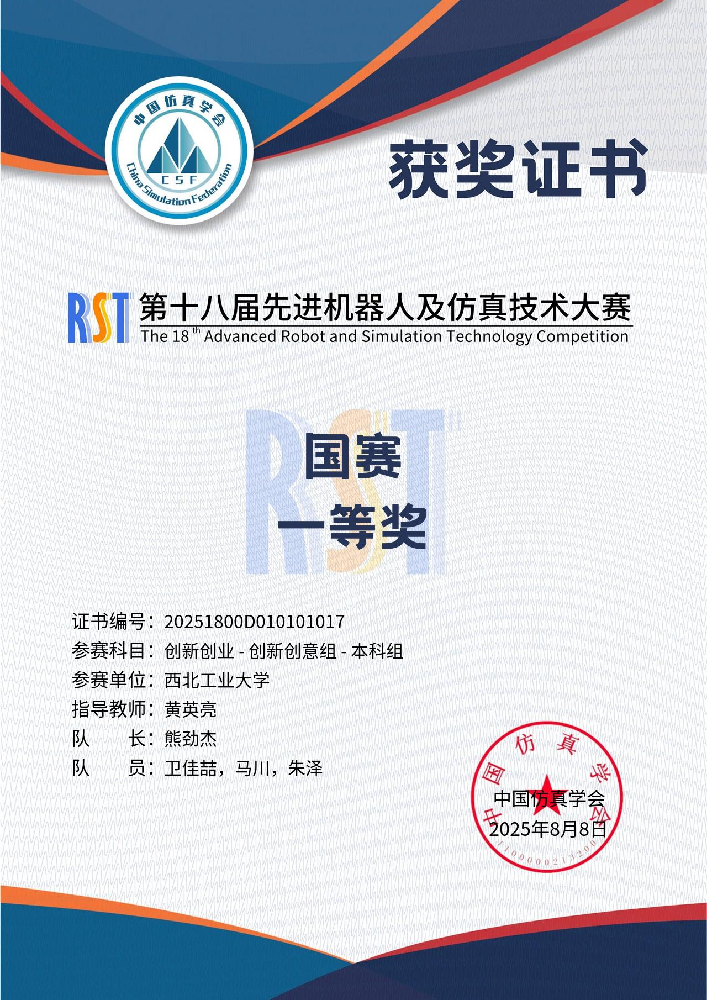
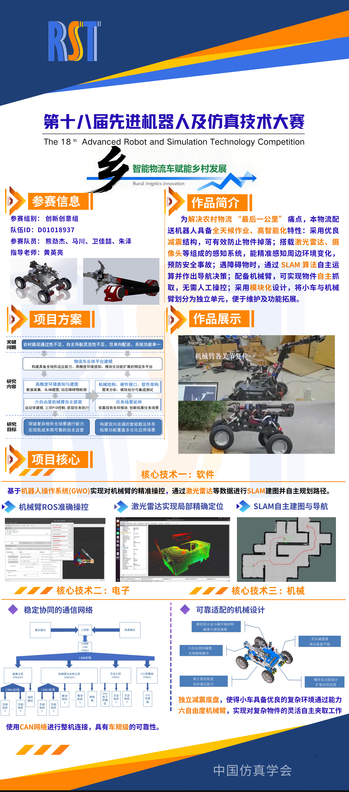
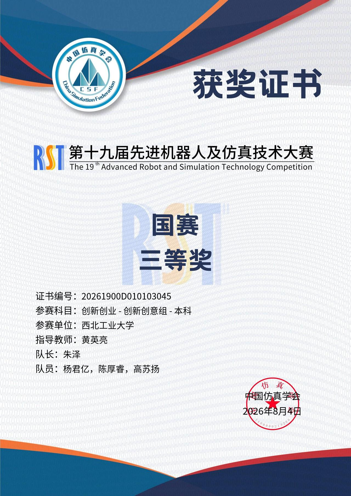
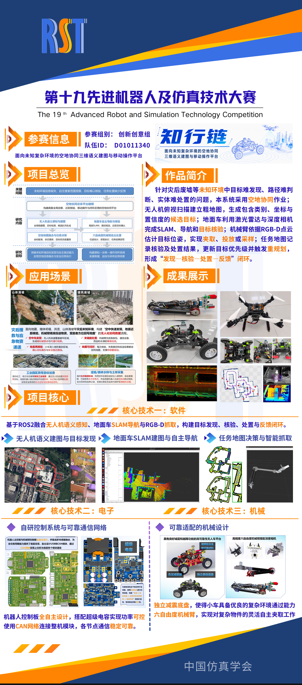

# 先进机器人及仿真技术大赛

## 2025

国赛一等奖

简介：为解决农村物流“最后一公里”痛点，本物流配送机器人具备全天候作业、高智能化特性：采用优良减震结构，可有效防止物件掉落；搭载激光雷达、摄像头等组成的感知系统，能精准感知周边环境变化，预防安全事故；遇障碍物时，通过SLAM算法自主运算并作出导航决策；配备机械臂，可实现物件自主抓取，无需人工操控；采用模块化设计，将小车与机械臂划分为独立单元，便于维护及功能拓展。

## 2026

国赛三等奖

简介：针对灾后废墟等未知环境中目标难发现、路径难判断、实体难处置的问题，本系统采用空地协同作业；无人机俯视扫描建立粗地图，生成包含类别、坐标与置信度的候选目标；地面车利用激光雷达与深度相机完成SLAM、导航和目标核验；机械臂依据RGB-D点云估计目标位姿，实现夹取、投放或采样；任务地图记录核验及处置结果，更新目标优先级并触发重规划，形成“发现一核验一处置一反馈”闭环。

